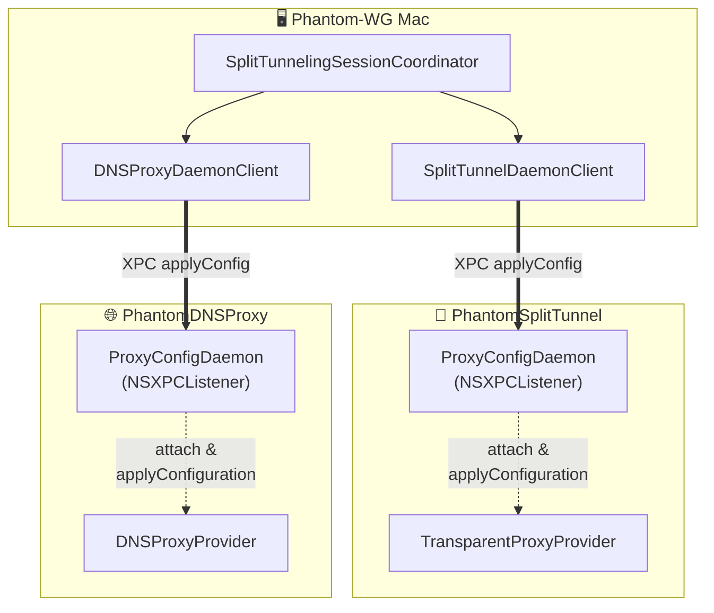

# ADR-0004 — Unified Proxy Config Daemon

## Status

Proposed — 2026-07-19

This ADR supersedes the following parts of ADR-0003 (***Split-Tunneling and DNS-Proxy Architecture***):

- **Item 3's "Reconfigure" phase** — sending `sendProviderMessage` with opcode `0x00` to **SplitTunnel**
- **Item 4** — the `DNSProxyDaemon` / `DNSProxyDaemonClient` names and the description of this XPC daemon as **DNSProxy**-specific
- **Item 5** — the lazy-spawn race protection (pendingConfig buffer) described as a **DNSProxy**-only mechanism
- **Item 7** — the `DNSProxyDaemonProtocol` name in the shared type list
- **The first mermaid in Context** — the asymmetric depiction of the two parallel control channels (**SplitTunnel** `sendProviderMessage` `0x00` vs **DNSProxy** XPC)

The rest of ADR-0003 remains in force: the carve-out backbone (item 2), the orchestrator lifecycle skeleton (item 3's start/stop/boot phases), strict mode (item 6), the system DNS toggle (item 8), and the data-path architecture. This ADR changes only the **control channel**; it does not touch the data path.

## Context

ADR-0003 built the **Split-Tunneling** feature on two independent system extensions (**PhantomSplitTunnel** + **PhantomDNSProxy**) and a single host app coordinating them. That decision left an asymmetry: the two extensions received live configuration from the host app through **two different IPC mechanisms**.

- **PhantomDNSProxy** hosted an in-process `NSXPCListener` (`DNSProxyDaemon`), up from the first line of [`main.swift`](https://github.com/ARAS-Workspace/phantom-wg/blob/mac-v1.3.1/PhantomDNSProxy/App/main.swift). The host app pushed configuration over XPC via `applyConfig`. Because the provider is lazy-spawned, the daemon buffered the payload in `pendingConfig` for a provider that had not yet been born, and replayed it at `attach`.
- **PhantomSplitTunnel** received its configuration via `NETunnelProviderSession`'s `sendProviderMessage` with opcode `0x00`. That channel was decoded in the provider's `handleAppMessage`.

This duality caused three concrete problems:

1. **Two code paths, one purpose.** Both extensions took the same payload (`SplitTunnelingConfiguration`) and did the same job (`applyConfiguration`), but over two entirely separate transport layers and two message-decoding paths. Reading and clearing logs (`fetchLogs` / `clearLogs`) were XPC RPCs on **DNSProxy**; on **SplitTunnel** they were separate opcodes.

2. **Lazy-spawn buffering was guaranteed on only one side.** On the **DNSProxy** side the daemon safely buffered configuration that arrived before the provider was born (ADR-0003 item 5). `NETransparentProxyProvider` is likewise lazy-spawned on the first flow; but on the `sendProviderMessage` path this buffering was handled by the provider's own state rather than by the guarantee the daemon pattern provides. Both extensions were exposed to the same lazy-spawn race, yet their protections against it differed.

3. **Peer-pin existed only on the XPC path.** The XPC peer verification added after ADR-0003 (`setCodeSigningRequirement`, Security fix `30ee73e`) lived in the **DNSProxy** daemon. **SplitTunnel**'s `sendProviderMessage` channel had a different trust model; the same certificate-based peer pin could not be expressed across both channels.

There was also a constraint in the opposite direction: **the main tunnel deliberately does not use this pattern.** **PhantomTunnel** (packet-tunnel-provider) runs with a static, user-initiated configuration; it is not lazy-spawned on the first flow and has no need for live reconfiguration. It keeps its own `sendProviderMessage` IPC for statistics, logs, and reset. The unification covers only the **two lazy-spawned proxy extensions**.

## Decision

The control channel of the two proxy extensions is unified onto a single generalized XPC daemon pattern. The `sendProviderMessage` channel is removed from **SplitTunnel** entirely. Refactor `2e573e2` implements this decision.



The two control channels are now **symmetric**. Both talk to an instance of the same `ProxyConfigDaemon` class over the same XPC contract. The only difference is the Mach service name.

1. **One daemon class, one receiver protocol.** [`Extensions/Domain/IPC/ProxyConfigDaemon.swift`](https://github.com/ARAS-Workspace/phantom-wg/blob/mac-v1.3.1/Extensions/Domain/IPC/ProxyConfigDaemon.swift) is a generic `NSXPCListener` server shared by both extensions. The provider that applies the configuration conforms to the `ProxyConfigReceiver` protocol:

   ```swift
   protocol ProxyConfigReceiver: AnyObject {
       func applyConfiguration(_ configuration: SplitTunnelingConfiguration)
   }
   ```

   Both [`TransparentProxyProvider`](https://github.com/ARAS-Workspace/phantom-wg/blob/mac-v1.3.1/PhantomSplitTunnel/App/TransparentProxyProvider.swift) and [`DNSProxyProvider`](https://github.com/ARAS-Workspace/phantom-wg/blob/mac-v1.3.1/PhantomDNSProxy/App/DNSProxyProvider.swift) conform to this protocol. The daemon binds to a receiver via `attach(provider:)` and forwards the payload to it; it does not need to know which provider it is.

2. **Process-local singleton, one instance per extension.** `ProxyConfigDaemon.shared` is unique within each extension's own process. The instance is set up and `start()`ed in the extension's [`main.swift`](https://github.com/ARAS-Workspace/phantom-wg/blob/mac-v1.3.1/PhantomSplitTunnel/App/main.swift) **before** the OS spawns the provider:

   ```swift
   // PhantomSplitTunnel/App/main.swift  (identical in DNSProxy with the dnsProxy name)
   ProxyConfigDaemon.shared = ProxyConfigDaemon(
       machServiceName: ProxyConfigService.splitTunnel,
       subsystem: "com.remrearas.Phantom-WG-MacOS.PhantomSplitTunnel"
   )
   ProxyConfigDaemon.shared?.start()
   ```

   Because the two extensions are separate processes, this `static` carries no ambiguity.

3. **A Mach service name per extension.** The two daemon instances are distinguished by two separate `application-groups`-prefixed Mach service names. The names are defined in the `ProxyConfigService` enum inside [`ProxyConfigDaemonProtocol.swift`](https://github.com/ARAS-Workspace/phantom-wg/blob/mac-v1.3.1/Phantom-WG-MacOS/Domain/IPC/ProxyConfigDaemonProtocol.swift):

   ```swift
   public enum ProxyConfigService {
       public static let dnsProxy    = "group.com.remrearas.phantom-wg-macos.dnsproxy"
       public static let splitTunnel = "group.com.remrearas.phantom-wg-macos.splittunnel"
   }
   ```

   Each extension's `Info.plist` must carry an `NEMachServiceName` entry to authorize the Mach service it vends. **DNSProxy** had carried this entry since the ADR-0003 era; when **SplitTunnel** gained its `main.swift` XPC listener, without `NEMachServiceName` the client hit a *"Couldn't communicate with a helper application"* error and the connection invalidated on the spot. That is why the entry is added under SplitTunnel's `info.properties` in [`project.yml`](https://github.com/ARAS-Workspace/phantom-wg/blob/mac-v1.3.1/project.yml) (xcodegen generates `Info.plist`; editing the generated file is not durable).

4. **`sendProviderMessage` is removed from SplitTunnel entirely.** The `handleAppMessage` method in [`TransparentProxyProvider`](https://github.com/ARAS-Workspace/phantom-wg/blob/mac-v1.3.1/PhantomSplitTunnel/App/TransparentProxyProvider.swift) is deleted. On the host-app side, the "Provider Messaging" section of [`SplitTunnelProviderManager`](https://github.com/ARAS-Workspace/phantom-wg/blob/mac-v1.3.1/Phantom-WG-MacOS/Infrastructure/Tunnel/SplitTunnelProviderManager.swift) (`reloadExtensionConfig` / `fetchLogs` / `clearLogs` / `sendOpcode`) is removed; the manager keeps only load / enable / disable / status responsibilities. The `reconfigure(with:)` method of [`SplitTunnelingSessionCoordinator`](https://github.com/ARAS-Workspace/phantom-wg/blob/mac-v1.3.1/Phantom-WG-MacOS/Infrastructure/Tunnel/SplitTunnelingSessionCoordinator.swift) now pushes symmetrically over XPC to both extensions:

   ```swift
   let splitPushed = await splitDaemonClient.applyConfig(config)   // previously sendProviderMessage 0x00
   let pushed      = await dnsDaemonClient.applyConfig(config)
   ```

5. **Lazy-spawn buffering is now shared by both extensions.** `ProxyConfigDaemon` holds a payload that arrives while no provider has yet `attach`ed in the `pendingConfig` buffer and replies `reply(true)` to the client; when the provider is born on the first flow and calls `attach(provider:)`, the buffer is drained and applied. This race protection — described as DNSProxy-only in ADR-0003 item 5 — now applies to **SplitTunnel** as well, through the same code path.

   ```mermaid
   sequenceDiagram
       App->>Daemon: applyConfig (XPC)
       Daemon->>Daemon: provider == nil → buffer pendingConfig
       Daemon-->>App: reply(true)
       Note over Daemon: ...later, on first flow...
       OS->>Provider: startProxy
       Provider->>Daemon: attach(provider:)
       Daemon->>Provider: applyConfiguration(pendingConfig)
   ```

6. **The peer-pin lives in one place and protects both extensions.** `shouldAcceptNewConnection` pins the incoming connection to our team's signature off the kernel audit token:

   ```swift
   newConnection.setCodeSigningRequirement(
       #"anchor apple generic and certificate leaf[subject.OU] = "9C5SL5H7CM""#
   )
   ```

   Because the Mach service name is registered under `application-groups`, any local process can look it up; and `applyConfig()` rewrites the split-tunnel exclude list — i.e. which flows bypass the VPN. An unverified peer would be a tunnel-bypass primitive. The pin is immune to the PID-reuse race carried by a manual `processIdentifier` check (macOS 13+). Since this protection lives in a single place in the daemon class, both extensions inherit it.

7. **Host-app side: one base client + two thin subclasses.** [`ProxyConfigDaemonClient`](https://github.com/ARAS-Workspace/phantom-wg/blob/mac-v1.3.1/Phantom-WG-MacOS/Infrastructure/IPC/ProxyConfigDaemonClient.swift) (`@Observable @MainActor`, non-final) carries the connect / `applyConfig` / `fetchLogs` / `clearLogs` and `withRaceTimeout` logic. The two proxies are distinguished by thin subclasses that fix the Mach service name ([`DNSProxyDaemonClient`](https://github.com/ARAS-Workspace/phantom-wg/blob/mac-v1.3.1/Phantom-WG-MacOS/Infrastructure/IPC/DNSProxyDaemonClient.swift), [`SplitTunnelDaemonClient`](https://github.com/ARAS-Workspace/phantom-wg/blob/mac-v1.3.1/Phantom-WG-MacOS/Infrastructure/IPC/SplitTunnelDaemonClient.swift)):

   ```swift
   final class DNSProxyDaemonClient: ProxyConfigDaemonClient {
       init() { super.init(machServiceName: ProxyConfigService.dnsProxy) }
   }
   final class SplitTunnelDaemonClient: ProxyConfigDaemonClient {
       init() { super.init(machServiceName: ProxyConfigService.splitTunnel) }
   }
   ```

   The distinct types are mandatory: SwiftUI's `@Environment(Type.self)` keys by exact type; two clients of the same base type can be carried in the environment together only as two different concrete types.

8. **The main tunnel is deliberately out.** **PhantomTunnel** (packet-tunnel-provider) does not join this pattern. Its configuration is static and user-initiated; it has no need for lazy-spawn or live reconfiguration. It keeps its own `sendProviderMessage` IPC for statistics, logs, and reset. The unification scope is only the two lazy-spawned proxy extensions.

## Consequences

- **One transport layer, one mental model.** The two proxy extensions now share the same XPC contract. Adding a new RPC covers both extensions at once; there is no need to track two separate message protocols — an opcode for **SplitTunnel**, an RPC for **DNSProxy**. Debugging follows a single channel.
- **Lazy-spawn race protection and peer-pin symmetric for free.** The `pendingConfig` buffering and the peer pin — living in a single place in the daemon class — protect both extensions automatically. Security and correctness guarantees are now pattern-based, not channel-based.
- **A new build constraint: the `NEMachServiceName` requirement.** Every proxy extension that vends an XPC listener must carry `NEMachServiceName` in its `Info.plist`; otherwise the client cannot reach the helper. This constraint is recorded in `project.yml` and holds for any future proxy extension as well.
- **Two near-identical log stores remain.** After the unification, `DNSProxyLogStore` and `SplitTunnelLogStore` differ only in a tag ("DNS" / "SPL"). Collapsing them into a single generic `ProxyLogStore(client:tag:)` is left open as a low-priority change; it does not affect the architectural decision.
- **ADR-0003 partially becomes history.** The sections listed above are marked "Superseded by ADR-0004". ADR-0003's data-path, carve-out, and strict-mode decisions remain in force; this ADR records only that the shape of the control channel changed.
