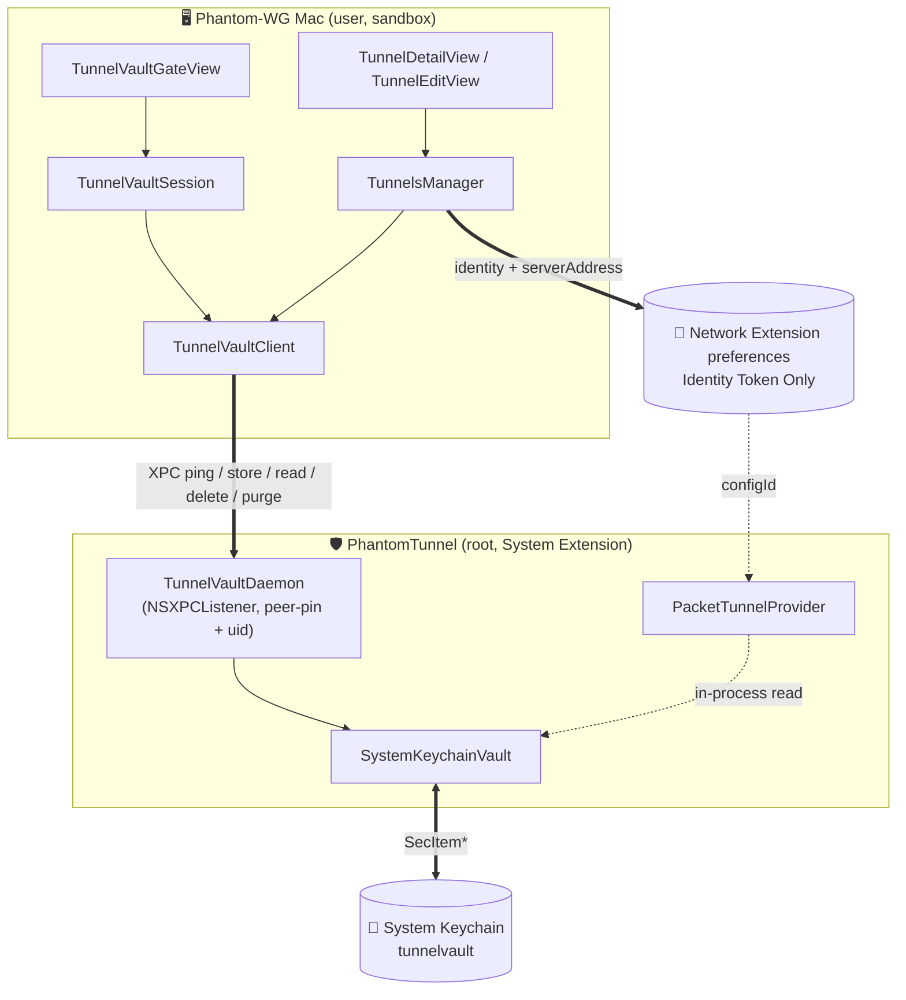

# ADR-0005 — A System Keychain Vault for Tunnel Secrets

## Status

Proposed — 2026-08-04

This ADR supersedes a previously accepted agreement. That agreement rested on the conclusion that "the **System Extension** cannot reach the Keychain." Because of it, focused on the tunnel's core value during development, I deferred the matter until I could reach a solution that would make it more stable. Until then, private keys were stored as plain base64 inside the `NETunnelProviderProtocol.providerConfiguration` dictionary. This was neither a recommended nor a suitable method.

Measurements and research prompted by that interim solution required revisiting the verdict and the architectural decision built on it — because the verdict is true for the login and data-protection Keychain domains, and not true for the file-based System Keychain.

This ADR changes only **where the secrets live**, the alignment between the two stores, and the condition under which the app connects to that store. It touches no other architectural decision.

## Context

### The Tunnel Configuration Model

The value referred to as the payload throughout this ADR is the `TunnelConfig` structure, the complete model of a tunnel:

```swift
struct TunnelConfig: Identifiable, Equatable, Codable {
    var id: UUID                    // configId: the account value in the vault
    var name: String
    var createdAt: Date
    var wireguard: WireguardConfig  // interface: privateKey, addresses, dnsServers, mtu
                                    // peer: publicKey, presharedKey?, allowedIPs, endpoint, persistentKeepalive
    var wstunnel: WstunnelConfig?   // url, secret, localHost, localPort, remoteHost, remotePort
}
```

Ghost mode is not a separate field; it is defined by the presence of the `wstunnel` section. The secret-bearing fields are `privateKey`, `presharedKey`, and the wstunnel `secret` value; all three live in the same payload body. The `identity` projection carries the four secret-free fields (`id`, `name`, `createdAt`, `isGhost`) to the Network Extension side.

### Where Did the Secrets Live?

A tunnel lived in its entirety as two JSON blobs inside the `providerConfiguration` dictionary. The on-disk counterpart of that dictionary is `/Library/Preferences/com.apple.networkextension.plist`.

### The Fragility of the System Store

One of the most visible faces of this fragility is that after the System Extension is uninstalled and reinstalled, no record remains in the Network Extension store and the user loses their configurations.

### Why the Keychain Was Thought Impossible

Earlier attempts had tested two doors, and both were closed:

- data-protection Keychain: `errSecNotAvailable` (`-25291`), because the extension has no user session.
- login Keychain: `errSecItemNotFound` (`-25300`), because the data lives in the user's keychain. It is not visible to a root daemon.

There was a third, untested door: **the file-based System Keychain**.

### What the Literature Says

- There is an answer from an Apple DTS Engineer to exactly this question. The host app talks to the extension over XPC; **the System Extension writes the secrets to the Keychain**; `providerConfiguration` carries only a token. In addition, the same answer states plainly that `providerConfiguration` is not a secure store. Source: [Apple Developer Forums 680013, DTS answer](https://developer.apple.com/forums/thread/680013)
- The official WireGuard app uses the login Keychain, because it ships with an **App Extension** and lives inside a user session. That path is not a fit for our architecture, because our architecture is founded on several **System Extensions**. Source: [wireguard-apple repository, `Sources/Shared/Keychain.swift`](https://github.com/WireGuard/wireguard-apple/blob/master/Sources/Shared/Keychain.swift)
- Apple's technote TN3137 states two facts as well. The file-based Keychain is not officially deprecated; only some of the API surface around it is. For processes running outside a user context, the file-based Keychain is the only option. The note also contains the critical sentence about the system context: the search list contains just the System Keychain, and it is the default Keychain. Source: [TN3137: On Mac keychains](https://developer.apple.com/documentation/technotes/tn3137-on-mac-keychains)

### Measurement

Before the decision was made, a seven-step probe ran inside the **System Extension**. The sandboxed extension, in a `uid=0` context, wrote to and read from the System Keychain, obtained a persistent reference, and read back through that reference. All seven steps returned `errSecSuccess`. This measurement became the real motivation behind the architectural decision.

## Decision

Tunnel secrets are stored in a **System Keychain** vault owned by the **System Extension**; across the product this vault carries the name **TunnelVault**. The system's Network Extension store is reduced to a projection that carries no secrets, and the alignment between the two stores is defined by a one-way truth relationship: **the vault is the source of truth**. The app looks at this store only through a session handshake. The handshake has two parties: on the app side, `TunnelVaultSession` manages the session and sends the call through `TunnelVaultClient`; on the extension side, `TunnelVaultDaemon` inside **PhantomTunnel** answers. Establishing the connection wakes the extension through launchd; until the handshake completes, the tunnel UI does not open.

**PhantomTunnel** and **TunnelVault** exist together — when one is absent, the other's existence is out of the question.



1. **The vault: one item per tunnel.** `service` is fixed (`com.remrearas.Phantom-WG-MacOS.tunnelvault`), `account` is the tunnel's `configId` value, and the payload is the JSON body containing the entire `TunnelConfig` value. `TunnelConfig` becomes `Codable` with this ADR. The **Wstunnel** secret and the WireGuard keys live in the same payload: there is **a single place** where a tunnel's secrets exist.

2. **The writer is the extension, not the app.** The System Keychain is root-owned and the app is a sandboxed user process. The app therefore never touches the vault; it asks the extension through `TunnelVaultClient`. `TunnelVaultDaemon` shares its skeleton with `ProxyConfigDaemon`: thanks to the `NEMachServiceName` entry in `Info.plist`, launchd wakes the extension on demand, and `shouldAcceptNewConnection` binds the incoming connection to our team's signature.

   ```swift
   newConnection.setCodeSigningRequirement(
       #"anchor apple generic and certificate leaf[subject.OU] = "9C5SL5H7CM""#
   )
   ```

3. **The vault speaks only the modern `SecItem` API family.** The `SecKeychain*` function family has been deprecated since macOS 10.10, and every path that can produce a `SecKeychainRef` belongs to that family. The vault therefore targets no Keychain file by name: per the TN3137 contract, in the system context every `SecItem` call already lands on the System Keychain. One side effect of that contract was measured in the field: the merged search list can present the same physical record more than once, so the enumeration deduplicates accounts. The location proof was verified on real hardware: records land in `/Library/Keychains/System.keychain`.

4. **`providerConfiguration` carries identity only.** The new `TunnelIdentity` value has four fields: `id`, `name`, `createdAt`, `isGhost`. There is nothing left worth stealing in the world-readable plist. The `serverAddress` field also carries a fixed label instead of the real endpoint, because that field shows up in System Settings and is written to the same plist:

   ```swift
   providerBundleIdentifier = "com.remrearas.Phantom-WG-MacOS.PhantomTunnel"
   serverAddress = "Phantom-WG"
   providerConfiguration = [
       "configId": identity.id.uuidString,
       "name": identity.name,
       "createdAt": identity.createdAt.timeIntervalSince1970,
       "isGhost": identity.isGhost
   ]
   ```

5. **The provider does its own reading in-process.** `startTunnel` takes the identity from `providerConfiguration` and reads the payload body directly with `SystemKeychainVault.fetchForProvider(id:)`. There is no XPC and no cleartext copy on disk; the secret is unsealed only in memory.

6. **User scoping, per connection.** The System Keychain belongs to the machine, not to a user. Every record is stamped with the uid that created it; every connection gets its own endpoint bound to the `effectiveUserIdentifier` value reported by the kernel. One session can therefore neither read, nor list, nor overwrite another's tunnels. The scope is a **boundary policy**, not a storage lock: the provider read in **Item 5** is deliberately out of scope, because the provider is not a peer and is starting the very configuration the system handed to it.

7. **The session lock: no handshake, no tunnel UI.** The readiness chain passes through two locks: are the extensions active (**ExtensionGate**), and is **PhantomTunnel** awake with the **TunnelVault** door open (`TunnelVaultSession`). The probe of the second lock is the `pingVault` call: establishing the XPC connection wakes the extension through launchd, and the extension proves the Keychain door and reports the number of payloads it holds; no secret moves. The two failures land on screen as two separate stories: the extension never answering is not the same thing as the extension answering yet failing to open the Keychain door. The lock is authoritative at entry; mid-session, a single timeout does not tear down the live list, because a running tunnel lives independently of the daemon process. When **ExtensionGate** drops, the session proof is voided with it: a reinstalled extension is a cold one, and a ready state that is no longer fresh is not to be trusted.

8. **Reconcile carries three duties and converges on the vault.** What the vault holds and the Network Extension side lacks is recreated; what the Network Extension side holds and the vault lacks is removed; a tunnel whose record exists but whose projection no longer matches its payload is rewritten in place; **at the end of the day the vault always wins.** The second duty destroys nothing, because the record being removed already points at a payload that does not exist. The alignment never touches an active tunnel and skips when it would produce a name collision.

   ```mermaid
   sequenceDiagram
       participant App as TunnelsManager
       participant V as TunnelVault
       participant NE as Network Extension preferences
       App->>V: readAll()
       alt the vault could not answer
           V-->>App: unreachable
           Note over App: nothing happens
       else the vault answered
           V-->>App: configs
           App->>V: read(id) (per-candidate confirmation)
           App->>NE: remove the record with no payload behind it
           App->>NE: create a record for the payload with none
           App->>NE: rewrite the drifted projection in place
       end
   ```

9. **Neither silence nor a failing answer counts as proof.** Both the single and the bulk read distinguish three outcomes: `.config`, `.missing`, `.unreachable`. If the vault did not answer, reconcile does not run at all; if the vault answered but **could not do the work**, the outcome is the same, because a Keychain that failed to enumerate must not look like an empty vault. A record that failed to read must not look like a record that does not exist either. The distinction is mechanical at its source: an empty array means truly empty, nil means an in-vault failure; and if the reply block never ran, the daemon never spoke.

10. **Idempotency, triggers, and coalescing.** Since reconcile only creates what is missing, removes what is surplus, and writes the projection only when it truly differs, a second pass over an unchanged world does nothing. The triggers fall through a single door: the `NEVPNConfigurationChange` notification and the return to the foreground merge into a single trailing refresh pass; it is normal for the system to announce one change as a volley of notifications, and every pass carries a full vault read that wakes the extension. The launch pass stands outside this door: it runs directly, before the list is published. The `isReconciling` flag guards against overlap and repetition.

11. **Ordering guarantees.** Adding: vault first, then Network Extension; if the Network Extension record cannot be created, the payload is rolled back. In the window between the payload write and the record landing, the tunnel's identity is marked in-flight; even when reconcile is triggered by a notification that is no longer fresh, it cannot create a record for that identity. Deleting: vault first, then Network Extension; if the vault cannot be deleted, the operation is cancelled and the tunnel stays whole.

12. **Name uniqueness is enforced at write time.** Import and edit both refuse a duplicate name; the vault write drops **other** payload records claiming the same name. If the deduplication cannot run, the vault is not answering and the write is refused: that is the single path a name collision could ever be born through, and it is closed. The skip behaviour inside reconcile remains the last defence of this scene that can no longer be staged: a colliding payload is never deleted, only skipped.

13. **There is no backward compatibility.** Old plain blobs are not migrated. Since their identities still parse, they appear in the list, but having no counterpart in the vault they are cleaned up by **Item 8**. Configurations from older versions are not migrated, and this ADR brings no state machine to migrate them; a path that was wrong to begin with has been abandoned, and since the app does not have a sizeable user base, the matter was settled this way.

## Consequences

### Measured Gains

- There are no secrets left in the plist on disk. `providerConfiguration` writes four identity fields.
- When a binary other than the extension tries to read a vault record, macOS demands administrator authorization. The extension, being the record's creator, reads without a prompt; every other binary hits an authorization dialog.
- When the vault lives through the **System Extension** being uninstalled and reinstalled, the tunnels the Network Extension store lost come back without a single question asked of the user.
- The custody layer uses only the modern `SecItem` API family; the deprecated `SecKeychain*` dependency is zero, and the build emits no warnings under this heading.
- When the vault cannot answer, the user sees not an empty list but a lock screen that names what is broken: a silent extension and an unopenable Keychain are separate diagnoses.

### Accepted Costs

- **Machine scope.** The System Keychain belongs to the machine, not the user. The uid scoping in **Item 6** balances that, but the scope stands at the XPC boundary, not in the application layer: an actor with root access can always read. This is the natural consequence of the single Keychain domain a **System Extension** can reach.
- **Deleting from the system is not final.** When the user deletes the VPN entry through System Settings, the entry comes back, because the vault still knows the tunnel. The only way to destroy a tunnel is to delete it from the app.
- **Consent prompts.** For every restored configuration, macOS asks "Allow VPN configurations" once. When several tunnels come back at the same time, these prompts can stack back to back.
- **Startup depends on a handshake.** Without the vault answering there is no tunnel list. On a launch where the extension cannot wake, the app waits on the lock screen after three attempts. That is the deliberate price of not showing a wreck that pretends to work.

### Edge Cases

| Situation | Behaviour | Assessment |
| --- | --- | --- |
| **TunnelVault** and the **Network Extension** store agree | The reconcile pass performs no operation | Expected behaviour |
| The **System Extension** was uninstalled and reinstalled, and the **Network Extension** store emptied | All tunnels are rebuilt from **TunnelVault** | The very purpose of the design |
| The user deleted the VPN configuration through System Settings while the app was open | The configuration is rebuilt on the change notification, by itself | Expected behaviour |
| The user deleted the tunnel inside the app | The **TunnelVault** record is deleted first and the tunnel does not come back | Expected behaviour |
| The **TunnelVault** record could not be deleted because the **System Extension** is unreachable | The deletion is cancelled and the tunnel stays whole | No half state forms |
| The **TunnelVault** record was deleted by hand through the Keychain | The **Network Extension** configuration is quietly removed | The user deleted the source of truth |
| **TunnelVault** does not answer, or answers but cannot complete the Keychain operation | The reconcile pass does not run at all | Neither silence nor a failing answer counts as proof |
| A read failed transiently | Three attempts are made, then a single warning is shown | A transient error is not presented as a permanent one |
| A payload does not decode | It is counted unusable and reported through the log | Schema drift becomes visible |
| A payload's name collides with a listed tunnel | The payload is skipped but never deleted | The last defence of a scene that structurally cannot be staged |
| An active tunnel has no payload behind it | The **Network Extension** configuration is not removed | The running session is left alone |
| The projection does not match the payload | It is realigned in place on the next reconcile pass | **TunnelVault** wins as the source of truth |
| The **System Extension** did not wake at launch | The lock screen is shown: three attempts and "Check Again" | No empty list appears |
| The **System Extension** is awake but the Keychain door did not open | It is shown as a separate failure story | The user sees what broke |
| **TunnelVault** is unanswering at the moment of import | The import is refused | A name collision cannot be born |
| A change notification that was no longer fresh arrived while a **Network Extension** configuration was being written | No second record is created for the in-flight identity | No twin record can be born |
| A multi-user Mac | Each session sees only its own payload set | The uid stamp and connection scoping |
| An old record with no ownership stamp | It belongs to no one and stays invisible | Ownership is never guessed |
