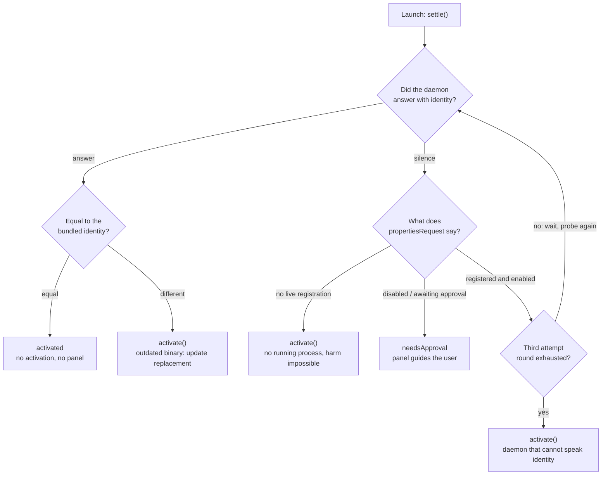

# ADR-0006 — Measured Activation

## Status

Accepted — 2026-08-05

This ADR supersedes the following parts of ADR-0002 (***Extension Gate Mechanism***):

- **The closing paragraph of item 1:** the principle that state changes are exclusively user-driven. There are now two doors: the boot measurement and user actions.
- **The "idempotent at the OS level" qualifier in item 4:** the assumption that an activation request for an already-enabled **System Extension** resolves silently with `.completed`. Field measurement proved otherwise: activation stages a full replacement even for a byte-identical bundle. This amounts to the termination of whatever state was active.
- **Item 6's list of sources:** the statement that state decisions derive solely from `propertiesRequest` answers. The extension's own identity declaration joined the decision sources; the principle of keeping no persistent state remains intact.

It also widens the session-probe RPC surface in item 7 of ADR-0005 (***System Keychain Vault for Tunnel Secrets***): the `pingVault` call's name and payload became `pingIdentity` (identity + door + count). The semantics of the session lock are unchanged.

## Context

From the user's perspective it went like this: the tunnel is up, the window gets closed from the top left, the app lives on in the background and traffic keeps flowing through the tunnel. Clicking the Dock icon to bring the window back made the **Extension Gate** panel flash for a moment, and the tunnel list showed everything off. The tunnel had really died. The same thing happened after quitting the app entirely and reopening it: opening the window was killing the tunnel.

From the system's perspective the mechanism reduces to a single line of log evidence:

```
actionForReplacingExtension: 2.0.0 → 2.0.0
```

Every activation request submitted through `OSSystemExtensionRequest` stages a full replacement even when the installed bundle version is byte-identical to the submitted one. The replacement kills the extension's running provider processes. The root view, in turn, was submitting activation for all three extensions on every window birth. The result: activation was working not as an installation tool but, unknowingly, as a session guillotine.

At its core the problem was a question gap. `propertiesRequest` answers "what is installed on the system"; it does not answer "is what is installed the binary I ship". As long as that second question had no answer, the only apparently safe move was to activate on every launch, and the price was sessions dying on every launch.

The ground for the answer was already prepared by the legacy of earlier decisions. The ADR-0004 and ADR-0005 refactors had given every extension an XPC daemon that lives from the first line of process birth; the mach services are registered with launchd and a call wakes a sleeping process. The extensions were already pingable. The only missing piece was an identity answer.

## Decision

1. **The identity stamp comes from a single source file.** [`ExtensionIdentity.current`](https://github.com/ARAS-Workspace/phantom-wg/blob/mac-v2.0.1/Phantom-WG-MacOS/Domain/IPC/ExtensionIdentity.swift) is the `MARKETING_VERSION` value and is compiled into all four targets from the same source file. The app's own value is the expectation for every extension it ships; divergence at build time is impossible. Because [`bump.sh`](https://github.com/ARAS-Workspace/phantom-wg/blob/mac-v2.0.1/.github/scripts/bump.sh) moves this value on every release, updates are caught without any extra discipline. `CURRENT_PROJECT_VERSION` is deliberately outside the stamp.

2. **Every extension declares its identity over its own daemon surface.** On the **PhantomTunnel** side the session probe widened: [`pingIdentity`](https://github.com/ARAS-Workspace/phantom-wg/blob/mac-v2.0.1/Phantom-WG-MacOS/Domain/IPC/TunnelVaultDaemonProtocol.swift) returns identity, vault door, and payload count over a single endpoint; no separate identity endpoint is opened on the vault daemon, one endpoint serves both locks, and even a door-failure answer is proof of liveness. The proxy extensions answer via [`fetchIdentity`](https://github.com/ARAS-Workspace/phantom-wg/blob/mac-v2.0.1/Phantom-WG-MacOS/Domain/IPC/ProxyConfigDaemonProtocol.swift), added to the shared protocol. There is one signal per extension and no cross-inference, because the daemon processes live and die independently.

3. **The launch does not activate; it measures.** Each controller's boot entry is the [`settle()`](https://github.com/ARAS-Workspace/phantom-wg/blob/mac-v2.0.1/Phantom-WG-MacOS/Infrastructure/Initialization/ExtensionGateController.swift) tree: if the probe answers, identities are compared; equality skips the activation and the panel entirely, inequality starts the legitimate update replacement. If the probe is silent, a single `propertiesRequest` delivers the verdict.

4. **Silence alone never activates immediately.** `activate()` is called on exactly three measured proofs: identity inequality, no live registration on the system, and the exhaustion of the attempt rounds. The exhaustion exception is bounded: a daemon that stays silent through three rounds while properties call it enabled is either a generation predating the identity contract or a wedged process; what repairs both is the replacement itself.

5. **The measurement runs once per process.** Window rebirths fall to the read-only path ([`checkAll()`](https://github.com/ARAS-Workspace/phantom-wg/blob/mac-v2.0.1/Phantom-WG-MacOS/Infrastructure/Initialization/ExtensionGateCoordinator.swift)). While the measurement is running, the foreground refresh skips that controller; the tree holds the write monopoly until its verdict is written. Once a legitimate activation begins, the promotion hold takes over: while an activation is in flight the `.activated` promotion is held even if properties say enabled, because promotion belongs to the completion path. The readiness signal therefore opens only after the replacement process has finished, and the post-process logic runs on clean ground.

6. **Nothing is kept persistent.** ADR-0002's principle continues, widened: no decision is cached, every launch decision is measured at that moment. Ground truth is now read from two sources: the operating system's registry and the extension's own identity declaration.

7. **The development equilibrium is built on the version.** A build recompiled under the same version leaves the old extension in place and says so plainly in the log. Requesting a replacement means raising the version; the sole owner of version management is the `bump.sh` flow.

## Decision Tree



## Edge Cases

| Edge case | Behavior |
|---|---|
| Healthy launch: probe answered, identity equal | `.activated` is written; there is neither an activation nor a panel. In field measurement all three extensions settled in about 50 ms |
| Update: probe answered, identity different | Immediate `activate()`; a single-pass replacement. Every inequality counts as stale, old-format stamps included |
| Probe silent, no live registration on the system | `activate()`; that extension cannot have a running process, so nobody gets hurt |
| Probe silent, registered but disabled or awaiting approval | `.needsApproval`; activation cannot repair this state, the panel guides the user toward System Settings |
| Probe silent, registered and enabled | Transient-failure assumption; three attempt rounds spaced 600 ms × attempt, no activation |
| Still silent and enabled after three rounds | A daemon that cannot speak identity: a pre-contract generation or a wedged process. `activate()` repairs both; the transition heals itself in one pass |
| Window rebirth | The measurement is once per process; later entries fall to the `checkAll()` read-only path, no replacement happens |
| Foreground refresh during the measurement | The `isSettling` flag exempts that controller from the refresh; a transient properties answer cannot overwrite the tree's verdict |
| Separating the settle query from normal interpretation | The properties query opened by settle is distinguished by object identity; normal status interpretation serves only `refresh()` calls |
| Properties say enabled while an activation is in flight | The `.activated` promotion is held; promotion belongs to the requery after `didFinishWithResult`. The readiness signal does not open before the storm ends |
| Scope of the promotion hold | Only the promotion is held; the `.needsApproval` and `.notInstalled` transitions stay live, the approval flow can never deadlock on the counter |
| Single-endpoint tunnel probe | The **PhantomTunnel** probe rides the same `pingIdentity` endpoint as the vault session; no separate identity endpoint exists on the vault daemon. Even a door-failure answer is proof of liveness |
| Composition without an injected probe | `settle()` falls back to the unmeasured old behavior: a direct `activate()`. Preview compositions take this path |
| Return after approval | An extension coming back from `.needsApproval` through the System Settings toggle is written `.activated` by the foreground refresh without an identity measurement; the next launch measures again. A conscious boundary |
| App removal | The sequential deactivation of `uninstallAll()` did not change; the next launch runs the clean install flow through the probe-silent, no-registration path |
| Development build under the same version | The old extension stays in place; the log signature `identity match ... activation skipped` always states the reason. Requesting a replacement means raising the version |

## Consequences

- Reopening the window or the app no longer kills the tunnel. Field proof: on every replacement-free launch the running **PhantomTunnel** process kept serving untouched, and the active tunnel survived the app relaunch.
- On a healthy launch the **Extension Gate** panel is effectively invisible; the measurement writes `.activated` within milliseconds.
- An update costs a single-pass session interruption. This is not a boundary; it is the definition of the moment the extension actually changes. In field observation the operating system re-established the active tunnel on its own after the replacement.
- The return-after-approval promotion is identity-less and trusts the next launch's measurement; it is the narrowest consciously accepted boundary.
- Extensions from generations before the identity contract pay the price of three attempt rounds on their first launch, get replaced through exhaustion, and the flow repairs itself permanently.

## What the Literature Says

- The `activationRequest` documentation does not define the request's behavior on an installed, byte-identical bundle; `actionForReplacingExtension` is described as being called only when a different version is found. Field measurement showed that the replacement delegate is called for an identical version pair too, and that running provider processes are killed. The decision is built on top of this gap: behavior is read from measurement, not from the document.
  https://developer.apple.com/documentation/systemextensions/ossystemextensionrequest
- The `propertiesRequest` answer coming back as an empty array for an installed-but-disabled extension is empirical behavior, and the burden of telling the cases apart falls on the application; that contract was documented in ADR-0002, and the silence branch of the settle tree leans on the same contract.
  https://developer.apple.com/documentation/systemextensions/ossystemextensionrequest/propertiesrequest(forextensionwithidentifier:queue:)
- The mach service is published to launchd via `NEMachServiceName`, and an `NSXPCConnection` call wakes a sleeping extension process; the probe's waking power comes from this contract. Its registration and preconditions were documented in ADR-0003 and ADR-0004.
  https://developer.apple.com/documentation/foundation/nsxpcconnection
