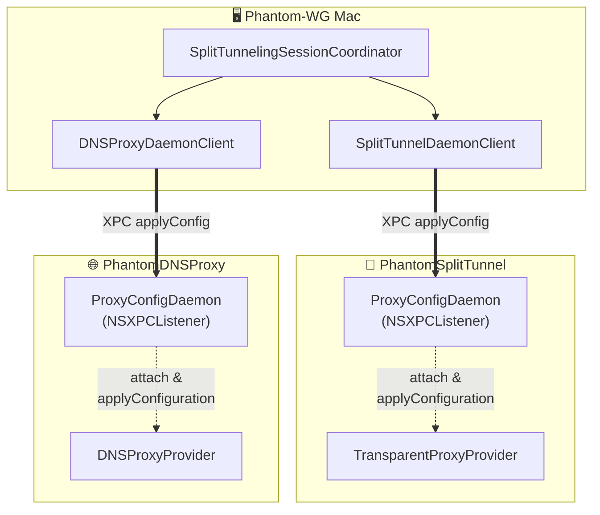

# ADR-0004 — Birleşik Proxy Config Daemon

## Durum

Önerildi — 2026-07-19

Bu ADR, ADR-0003'ün (***Split-Tunneling ve DNS-Proxy Mimarisi***) aşağıdaki bölümlerinin yerini alır:

- **Madde 3'ün "Yeniden yapılandır" evresi:** **SplitTunnel**'a opcode `0x00` ile `sendProviderMessage` gönderilmesi
- **Madde 4:** `DNSProxyDaemon` / `DNSProxyDaemonClient` isimleri ve bu XPC daemon'un yalnızca **DNSProxy**'ye özgü tarif edilmesi
- **Madde 5:** lazy-spawn race korumasının (pendingConfig buffer) yalnızca **DNSProxy**'ye ait bir mekanizma olarak anlatılması
- **Madde 7:** paylaşılan tip listesindeki `DNSProxyDaemonProtocol` adı
- **Bağlam'daki birinci mermaid:** iki paralel kontrol kanalının (**SplitTunnel** `sendProviderMessage` `0x00` vs **DNSProxy** XPC) asimetrik gösterimi

ADR-0003'ün geri kalanı; carve-out omurgası (madde 2), orchestrator lifecycle'ının çatısı (madde 3'ün başlat/durdur/önyükleme evreleri), strict mode (madde 6), sistem DNS toggle'ı (madde 8) ve veri yolu mimarisi yürürlükte kalır. Bu ADR yalnızca **kontrol kanalını** değiştirir; veri yoluna dokunmaz.

## Bağlam

ADR-0003, **Split-Tunneling** özelliğini birbirinden bağımsız iki sistem uzantısı (**PhantomSplitTunnel** + **PhantomDNSProxy**) ve bunları koordine eden tek bir ana uygulama üzerine kurdu. O kararın bıraktığı bir asimetri vardı: iki uzantı, ana uygulamadan canlı konfigürasyonu **iki farklı IPC mekanizmasıyla** alıyordu.

- **PhantomDNSProxy**, [`main.swift`](https://github.com/ARAS-Workspace/phantom-wg/blob/mac-v1.3.1/PhantomDNSProxy/App/main.swift)'in ilk satırından itibaren ayakta olan bir in-process `NSXPCListener` (`DNSProxyDaemon`) barındırıyordu. Ana uygulama konfigürasyonu XPC `applyConfig` ile push ediyordu. Provider lazy-spawn olduğundan, daemon henüz doğmamış provider için payload'u `pendingConfig` buffer'ında tutup `attach` anında yeniden uyguluyordu.
- **PhantomSplitTunnel**, konfigürasyonu `NETunnelProviderSession`'ın `sendProviderMessage`'ı üzerinden opcode `0x00` ile alıyordu. Bu kanal provider'ın `handleAppMessage`'ında çözülüyordu.

Bu ikilik üç somut probleme yol açıyordu:

1. **İki kod yolu, tek amaç.** Her iki uzantı da aynı payload'u (`SplitTunnelingConfiguration`) alıp aynı işi (`applyConfiguration`) yapıyordu, ama tamamen ayrı iki taşıma katmanı ve iki mesaj çözme yolu üzerinden. Log okuma ve temizleme (`fetchLogs` / `clearLogs`) **DNSProxy**'de XPC RPC'leriydi; **SplitTunnel**'da ayrı opcode'lardı.

2. **Lazy-spawn tamponlaması yalnız bir tarafta garantiliydi.** **DNSProxy** tarafında daemon, provider doğmadan gelen konfigürasyonu güvenle tamponluyordu (ADR-0003 madde 5). `NETransparentProxyProvider` de aynı şekilde ilk flow'da lazy-spawn olur; ancak `sendProviderMessage` yolunda bu tamponlama daemon deseninin sağladığı garantiyle değil, provider'ın kendi durumuyla ele alınıyordu. İki uzantı aynı lazy-spawn yarışına maruz kalmasına rağmen buna karşı korumaları farklıydı.

3. **Peer-pin yalnız XPC yolundaydı.** ADR-0003 sonrası eklenen XPC peer doğrulaması (`setCodeSigningRequirement`, Security düzeltmesi `30ee73e`) **DNSProxy** daemon'unda vardı. **SplitTunnel**'ın `sendProviderMessage` kanalının kendi güven modeli farklıydı; aynı sertifika-tabanlı peer pin'i iki kanalda birden ifade etmek mümkün değildi.

Karşı yönde bir kısıt da vardı: **ana tünel bilinçli olarak bu deseni kullanmaz.** **PhantomTunnel** (packet-tunnel-provider) statik ve kullanıcı-tetikli bir konfigürasyonla çalışır; ilk flow'da lazy-spawn olmaz, canlı yeniden yapılandırma ihtiyacı yoktur. Kendi `sendProviderMessage` IPC'sini istatistik, log ve reset için kullanmaya devam eder. Birleştirme yalnızca **lazy-spawn olan iki proxy uzantısını** kapsar.

## Karar

İki proxy uzantısının kontrol kanalı, tek bir genelleştirilmiş XPC daemon deseni üzerinde birleştirilir. `sendProviderMessage` kanalı **SplitTunnel**'dan tamamen kaldırılır. Refactor `2e573e2` bu kararı hayata geçirir.



İki kontrol kanalı artık **simetriktir**. Her ikisi de aynı `ProxyConfigDaemon` sınıfının bir örneğine, aynı XPC sözleşmesiyle konuşur. Fark yalnızca Mach service ismindedir.

1. **Tek daemon sınıfı, tek receiver protokolü.** [`Extensions/Domain/IPC/ProxyConfigDaemon.swift`](https://github.com/ARAS-Workspace/phantom-wg/blob/mac-v1.3.1/Extensions/Domain/IPC/ProxyConfigDaemon.swift) her iki uzantının paylaştığı generic bir `NSXPCListener` sunucusudur. Konfigürasyonu uygulayacak provider, `ProxyConfigReceiver` protokolüne uyar:

   ```swift
   protocol ProxyConfigReceiver: AnyObject {
       func applyConfiguration(_ configuration: SplitTunnelingConfiguration)
   }
   ```

   Hem [`TransparentProxyProvider`](https://github.com/ARAS-Workspace/phantom-wg/blob/mac-v1.3.1/PhantomSplitTunnel/App/TransparentProxyProvider.swift) hem [`DNSProxyProvider`](https://github.com/ARAS-Workspace/phantom-wg/blob/mac-v1.3.1/PhantomDNSProxy/App/DNSProxyProvider.swift) bu protokole uyar. Daemon `attach(provider:)` ile bir receiver'a bağlanır ve payload'u ona iletir; hangi provider olduğunu bilmesi gerekmez.

2. **Süreç-yerel singleton, uzantı başına bir örnek.** `ProxyConfigDaemon.shared` her uzantının kendi sürecinde benzersizdir. Örnek, uzantının [`main.swift`](https://github.com/ARAS-Workspace/phantom-wg/blob/mac-v1.3.1/PhantomSplitTunnel/App/main.swift)'inde OS provider'ı spawn etmeden **önce** kurulur ve `start()` edilir:

   ```swift
   // PhantomSplitTunnel/App/main.swift  (DNSProxy'de dnsProxy ismiyle özdeş)
   ProxyConfigDaemon.shared = ProxyConfigDaemon(
       machServiceName: ProxyConfigService.splitTunnel,
       subsystem: "com.remrearas.Phantom-WG-MacOS.PhantomSplitTunnel"
   )
   ProxyConfigDaemon.shared?.start()
   ```

   İki uzantı ayrı süreçler olduğundan bu `static` belirsizlik taşımaz.

3. **Uzantı başına Mach service ismi.** İki daemon örneği, `application-groups` prefix'li iki ayrı Mach service ismiyle ayrışır. İsimler [`ProxyConfigDaemonProtocol.swift`](https://github.com/ARAS-Workspace/phantom-wg/blob/mac-v1.3.1/Phantom-WG-MacOS/Domain/IPC/ProxyConfigDaemonProtocol.swift) içindeki `ProxyConfigService` enum'unda tanımlıdır:

   ```swift
   public enum ProxyConfigService {
       public static let dnsProxy    = "group.com.remrearas.phantom-wg-macos.dnsproxy"
       public static let splitTunnel = "group.com.remrearas.phantom-wg-macos.splittunnel"
   }
   ```

   Her uzantının `Info.plist`'i, vend ettiği Mach service'i yetkilemek için `NEMachServiceName` girdisi taşımak zorundadır. **DNSProxy** bu girdiyi ADR-0003 döneminden beri taşıyordu; **SplitTunnel**'a `main.swift` XPC listener'ı kazandığında `NEMachServiceName` eklenmeden istemci *"Couldn't communicate with a helper application"* hatası alıp bağlantı anında invalidate oluyordu. Bu yüzden girdi [`project.yml`](https://github.com/ARAS-Workspace/phantom-wg/blob/mac-v1.3.1/project.yml)'de **SplitTunnel** `info.properties` altına eklenir (xcodegen `Info.plist`'i üretir; üretilen dosyayı elle düzenlemek kalıcı değildir).

4. **`sendProviderMessage` SplitTunnel'dan tamamen kaldırılır.** [`TransparentProxyProvider`](https://github.com/ARAS-Workspace/phantom-wg/blob/mac-v1.3.1/PhantomSplitTunnel/App/TransparentProxyProvider.swift)'daki `handleAppMessage` metodu silinir. Ana uygulama tarafındaki [`SplitTunnelProviderManager`](https://github.com/ARAS-Workspace/phantom-wg/blob/mac-v1.3.1/Phantom-WG-MacOS/Infrastructure/Tunnel/SplitTunnelProviderManager.swift)'ın "Provider Messaging" bölümü (`reloadExtensionConfig` / `fetchLogs` / `clearLogs` / `sendOpcode`) kaldırılır; manager yalnızca load / enable / disable / status sorumluluğunda kalır. [`SplitTunnelingSessionCoordinator`](https://github.com/ARAS-Workspace/phantom-wg/blob/mac-v1.3.1/Phantom-WG-MacOS/Infrastructure/Tunnel/SplitTunnelingSessionCoordinator.swift)'ın `reconfigure(with:)` metodu artık iki uzantıya da simetrik XPC push yapar:

   ```swift
   let splitPushed = await splitDaemonClient.applyConfig(config)   // önceden sendProviderMessage 0x00
   let pushed      = await dnsDaemonClient.applyConfig(config)
   ```

5. **Lazy-spawn tamponlaması artık iki uzantı için de ortaktır.** `ProxyConfigDaemon`, provider henüz `attach` etmemişken gelen payload'u `pendingConfig` buffer'ında tutar ve istemciye `reply(true)` döner; provider ilk flow'da doğup `attach(provider:)` çağırdığında buffer çözülüp uygulanır. ADR-0003 madde 5'te yalnız **DNSProxy**'ye ait tarif edilen bu race koruması, artık aynı kod yoluyla **SplitTunnel** için de geçerlidir.

   ```mermaid
   sequenceDiagram
       App->>Daemon: applyConfig (XPC)
       Daemon->>Daemon: provider == nil → buffer pendingConfig
       Daemon-->>App: reply(true)
       Note over Daemon: ...later, on first flow...
       OS->>Provider: startProxy
       Provider->>Daemon: attach(provider:)
       Daemon->>Provider: applyConfiguration(pendingConfig)
   ```

6. **Peer-pin tek noktada, iki uzantıyı birden korur.** `shouldAcceptNewConnection`, gelen bağlantıyı kernel audit token üzerinden takımımızın imzasına pinler:

   ```swift
   newConnection.setCodeSigningRequirement(
       #"anchor apple generic and certificate leaf[subject.OU] = "9C5SL5H7CM""#
   )
   ```

   Mach service ismi `application-groups` altında register edildiğinden yerel herhangi bir süreç onu arayabilir; `applyConfig()` ise split-tunnel dışlama listesini, yani hangi flow'ların VPN'i bypass edeceğini, yeniden yazar. Doğrulanmamış bir peer, bir tünel-bypass primitifi olurdu. Pin, elle yapılan bir `processIdentifier` kontrolünün taşıdığı PID-reuse yarışına karşı dirençlidir (macOS 13+). Bu koruma daemon sınıfında tek yerde yaşadığından iki uzantı da onu devralır.

7. **Ana uygulama tarafı: bir base client + iki ince alt sınıf.** [`ProxyConfigDaemonClient`](https://github.com/ARAS-Workspace/phantom-wg/blob/mac-v1.3.1/Phantom-WG-MacOS/Infrastructure/IPC/ProxyConfigDaemonClient.swift) (`@Observable @MainActor`, non-final) bağlan / `applyConfig` / `fetchLogs` / `clearLogs` ve `withRaceTimeout` mantığını taşır. İki proxy, Mach service ismini sabitleyen ince alt sınıflarla ([`DNSProxyDaemonClient`](https://github.com/ARAS-Workspace/phantom-wg/blob/mac-v1.3.1/Phantom-WG-MacOS/Infrastructure/IPC/DNSProxyDaemonClient.swift), [`SplitTunnelDaemonClient`](https://github.com/ARAS-Workspace/phantom-wg/blob/mac-v1.3.1/Phantom-WG-MacOS/Infrastructure/IPC/SplitTunnelDaemonClient.swift)) ayrışır:

   ```swift
   final class DNSProxyDaemonClient: ProxyConfigDaemonClient {
       init() { super.init(machServiceName: ProxyConfigService.dnsProxy) }
   }
   final class SplitTunnelDaemonClient: ProxyConfigDaemonClient {
       init() { super.init(machServiceName: ProxyConfigService.splitTunnel) }
   }
   ```

   Ayrı tipler zorunludur: SwiftUI `@Environment(Type.self)` tam tipe göre anahtarlanır; aynı base tipin iki istemcisi ancak iki farklı somut tiple ortamda birlikte taşınabilir.

8. **Ana tünel bilinçli olarak dışarıda.** **PhantomTunnel** (packet-tunnel-provider) bu desene katılmaz. Konfigürasyonu statik ve kullanıcı-tetiklidir; lazy-spawn ve canlı yeniden yapılandırma ihtiyacı yoktur. Kendi `sendProviderMessage` IPC'sini istatistik, log ve reset için korur. Birleştirme kapsamı yalnızca lazy-spawn olan iki proxy uzantısıdır.

## Sonuçlar

- **Tek taşıma katmanı, tek zihinsel model.** İki proxy uzantısı artık aynı XPC sözleşmesini paylaşır. Yeni bir RPC eklemek, iki uzantıyı da aynı anda kapsar; **SplitTunnel** için opcode, **DNSProxy** için RPC gibi iki ayrı mesaj protokolüne bakmak gerekmez. Debug tek bir kanalı izler.
- **Lazy-spawn race koruması ve peer-pin simetrik.** Daemon sınıfında tek yerde yaşayan `pendingConfig` tamponlaması ve peer pin, iki uzantıyı da otomatik korur. Güvenlik ve doğruluk garantileri artık kanal-bazlı değil, desen-bazlıdır.
- **Yeni bir yapılandırma kısıtı: `NEMachServiceName` zorunluluğu.** XPC listener vend eden her proxy uzantısı, `Info.plist`'inde `NEMachServiceName` taşımak zorundadır; aksi halde istemci helper'a ulaşamaz. Bu kısıt `project.yml`'de kayıt altındadır ve gelecekte eklenecek bir proxy uzantısı için de geçerlidir.
- **İki near-identical log store kaldı.** Birleştirme sonrası `DNSProxyLogStore` ve `SplitTunnelLogStore` yalnızca bir etikette ("DNS" / "SPL") farklılaşır. Bunları tek bir generic `ProxyLogStore(client:tag:)` altında toplamak düşük öncelikli bir değişiklik olarak açık bırakılmıştır; mimari kararı etkilemez.
- **ADR-0003 kısmen tarih olur.** Yukarıda listelenen bölümler "Yerini ADR-0004 Aldı" olarak işaretlenir. ADR-0003'ün veri yolu, carve-out ve strict-mode kararları yürürlükte kalır; bu ADR yalnızca kontrol kanalının şeklini değiştirdiğini kayıt altına alır.
