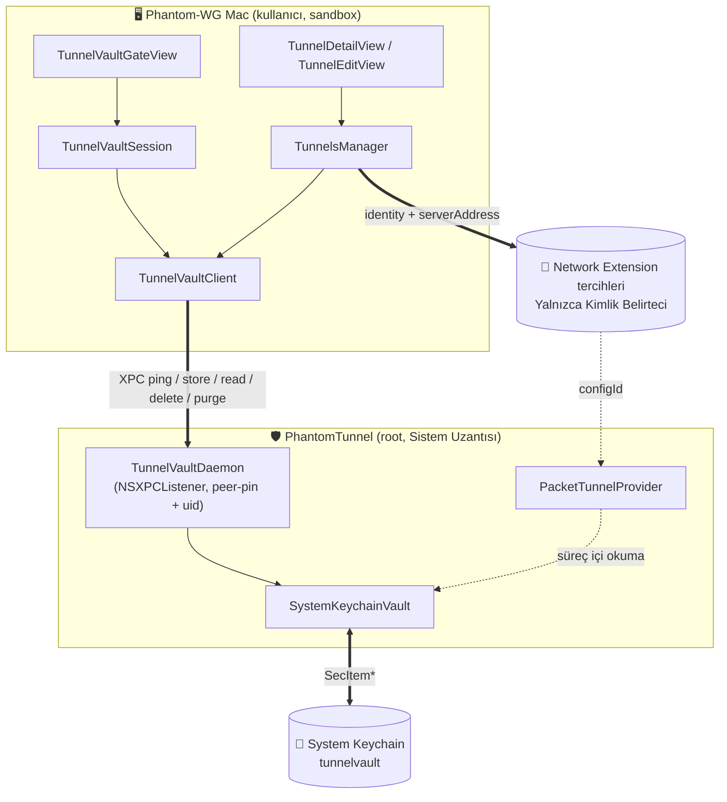

# ADR-0005 — Tünel Sırları için System Keychain Kasası

## Durum

Kabul Edildi — 2026-08-05

Bu ADR, daha önce kabul edilmiş bir anlaşmanın yerini alır. Bu anlaşma, "**Sistem Uzantısı (System Extension)** Keychain tarafına erişemiyor." sonucuna dayanıyordu. Bu nedenden dolayı geliştirme süreçlerinde tünelin temel katma değerine odaklandığımdan bunu daha stabil hale getireceğim bir çözüme ulaşana kadar beklettim. Bu zamana kadar `NETunnelProviderProtocol.providerConfiguration` sözlüğü içinde özel anahtarlar düz base64 olarak saklanıyordu. Bu tavsiye edilen ve uygun bir yöntem değildi. 

Bir önceki geçici çözüme istinaden ölçüm ve araştırmalar, bu varılan yargının ve mimari kararın tekrardan ele alınmasını gerektirdi. Çünkü bu yargı login ve data-protection Keychain alanları için doğrudur, dosya tabanlı System Keychain için değildir.

Bu ADR yalnızca **sırların nerede durduğunu**, iki depo arasındaki hizalamayı ve uygulamanın bu depoya bağlanma koşulunu değiştirir. Diğer mimari kararlara dokunmaz.

ADR-0006 (***Ölçülen Aktivasyon***), 7. maddedeki oturum sondasının RPC yüzeyini genişletti: `pingVault` çağrısının adı ve yükü `pingIdentity` olmuştur. Oturum kilidinin semantiği yürürlüktedir.

## Bağlam

### Tünel Konfigürasyonunun Modeli

Bu ADR boyunca payload olarak anılan değer, bir tünelin eksiksiz modeli olan [`TunnelConfig`](https://github.com/ARAS-Workspace/phantom-wg/blob/mac-v2.0.0/Phantom-WG-MacOS/Domain/Configuration/TunnelConfig.swift) yapısıdır:

```swift
struct TunnelConfig: Identifiable, Equatable, Codable {
    var id: UUID                    // configId: kasadaki account değeri
    var name: String
    var createdAt: Date
    var wireguard: WireguardConfig  // interface: privateKey, addresses, dnsServers, mtu
                                    // peer: publicKey, presharedKey?, allowedIPs, endpoint, persistentKeepalive
    var wstunnel: WstunnelConfig?   // url, secret, localHost, localPort, remoteHost, remotePort
}
```

Ghost mod ayrı bir alan değildir; `wstunnel` bölümünün varlığıyla tanımlanır. Sır taşıyan alanlar `privateKey`, `presharedKey` ve wstunnel `secret` değerleridir; üçü de aynı payload gövdesinde yaşar. `identity` izdüşümü ise sır içermeyen dört alanı (`id`, `name`, `createdAt`, `isGhost`) Network Extension tarafına taşır.

### Sırlar Nerede Duruyordu?

Bir tünelin tamamı, `providerConfiguration` sözlüğünde iki JSON blob olarak yaşıyordu. Bu sözlüğün diskteki karşılığı `/Library/Preferences/com.apple.networkextension.plist` dosyasıdır.

### Sistem Deposunun Kırılganlığı

Bu kırılganlığın en belirgin taraflarından birisi Sistem Uzantısı kaldırılıp yeniden kurulduktan sonra Network Extension deposunda kayıt kalmaması ve kullanıcının konfigürasyonlarını kaybetmesidir. 

### Keychain Neden İmkânsız Sanılıyordu?

Daha önceki denemeler iki kapıyı test etmişti ve ikisi de kapalıydı:

- data-protection Keychain: `errSecNotAvailable` (`-25291`), çünkü uzantı bir kullanıcı oturumuna sahip değildir.
- login Keychain: `errSecItemNotFound` (`-25300`), çünkü veri kullanıcının anahtar zincirindedir. Kök daemon tarafından görünebilir durumda değildir.

Test edilmemiş üçüncü bir kapı vardı: **dosya tabanlı System Keychain**. 

### Literatürün Söyledikleri

- Apple DTS Mühendisi tarafından tam bu soruya verilen bir yanıt mevcuttur. Ana uygulama, XPC üzerinden uzantıyla konuşur; **sırları Sistem Uzantısı Keychain üzerine yazar**; `providerConfiguration` yalnızca bir belirteç taşır. Ek olarak aynı yanıt, `providerConfiguration` alanının güvenli bir depo olmadığını açıkça söyler. Kaynak: [Apple Developer Forums 680013, DTS yanıtı](https://developer.apple.com/forums/thread/680013)
- Resmî WireGuard uygulaması login Keychain alanını kullanır, çünkü beraberinde bir **Uygulama Uzantısı (App Extension)** çalıştırır ve kullanıcı oturumu içinde yaşar. Bu yol bizim mimarimiz için uygun bir çözüm değil, çünkü mimarimizin temelinde birçok **Sistem Uzantısı (System Extension)** yer alıyor. Kaynak: [wireguard-apple deposu, `Sources/Shared/Keychain.swift`](https://github.com/WireGuard/wireguard-apple/blob/master/Sources/Shared/Keychain.swift)
- Apple TN3137 teknik notu da iki gerçeği belirtmektedir. Dosya tabanlı Keychain resmî olarak deprecated değildir, yalnız çevresindeki bazı API yüzeyleri deprecated durumdadır. Kullanıcı bağlamı dışında çalışan süreçler için tek seçenek dosya tabanlı Keychain alanıdır. Aynı not, system context için kritik cümleyi de içerir: arama listesi yalnız System Keychain içerir ve varsayılan Keychain odur. Kaynak: [TN3137: On Mac keychains](https://developer.apple.com/documentation/technotes/tn3137-on-mac-keychains)

### Ölçüm

Kararı vermeden önce **Sistem Uzantısı** içinden yedi adımlık bir probe çalıştırıldı. Sandbox içindeki uzantı, `uid=0` bağlamında System Keychain üzerine yazdı ve okudu, persistent reference aldı ve o referansla geri okudu. Yedi adımın yedisi de `errSecSuccess` döndü. Bu ölçüm sonucu mimari kararın asıl motivasyon kaynağı oldu.

## Karar

Tünel sırları, **Sistem Uzantısı** sahipliğindeki bir **System Keychain** kasasında saklanır; bu kasa ürün genelinde **TunnelVault** adını taşır. Sistemin Network Extension deposu, sır taşımayan bir izdüşüme indirgenir ve iki depo arasındaki hizalama tek yönlü bir doğruluk ilişkisiyle tanımlanır: **kasa doğruluk kaynağıdır**. Uygulama bu depoya yalnız bir oturum el sıkışması üzerinden bakar. Bu el sıkışmasının iki tarafı vardır: uygulama tarafında oturumu yöneten [`TunnelVaultSession`](https://github.com/ARAS-Workspace/phantom-wg/blob/mac-v2.0.0/Phantom-WG-MacOS/Infrastructure/Initialization/TunnelVaultSession.swift), çağrıyı [`TunnelVaultClient`](https://github.com/ARAS-Workspace/phantom-wg/blob/mac-v2.0.0/Phantom-WG-MacOS/Infrastructure/IPC/TunnelVaultClient.swift) üzerinden gönderir; uzantı tarafında ise **PhantomTunnel** içindeki [`TunnelVaultDaemon`](https://github.com/ARAS-Workspace/phantom-wg/blob/mac-v2.0.0/PhantomTunnel/Infrastructure/TunnelVaultDaemon.swift) cevap verir. Bağlantının kurulması launchd üzerinden uzantıyı uyandırır; el sıkışması tamamlanmadan tünel arayüzü açılmaz.

**PhantomTunnel** ve **TunnelVault** birlikte var olur, biri yokken diğerinin varlığı söz konusu değildir.



1. **Kasa: tünel başına tek item.** `service` sabittir (`com.remrearas.Phantom-WG-MacOS.tunnelvault`), `account` tünelin `configId` değeridir, payload ise `TunnelConfig` değerinin tamamını içeren JSON gövdesidir. `TunnelConfig` bu ADR ile `Codable` olur. **Wstunnel** secret değeri de WireGuard anahtarları da aynı payload içindedir: bir tünelin sırlarının bulunduğu **tek bir yer** vardır.

2. **Yazan taraf uzantıdır, uygulama değil.** System Keychain root sahipliğindedir ve uygulama sandbox içinde bir kullanıcı sürecidir. Bu yüzden uygulama kasaya hiç dokunmaz; [`TunnelVaultClient`](https://github.com/ARAS-Workspace/phantom-wg/blob/mac-v2.0.0/Phantom-WG-MacOS/Infrastructure/IPC/TunnelVaultClient.swift) üzerinden uzantıya sorar. [`TunnelVaultDaemon`](https://github.com/ARAS-Workspace/phantom-wg/blob/mac-v2.0.0/PhantomTunnel/Infrastructure/TunnelVaultDaemon.swift), [`ProxyConfigDaemon`](https://github.com/ARAS-Workspace/phantom-wg/blob/mac-v2.0.0/Extensions/Domain/IPC/ProxyConfigDaemon.swift) ile aynı iskelettedir: `Info.plist` içindeki `NEMachServiceName` kaydı sayesinde launchd uzantıyı talep üzerine uyandırır, `shouldAcceptNewConnection` gelen bağlantıyı takımımızın imzasına bağlar.

   ```swift
   newConnection.setCodeSigningRequirement(
       #"anchor apple generic and certificate leaf[subject.OU] = "9C5SL5H7CM""#
   )
   ```

3. **Kasa yalnız modern `SecItem` API ailesiyle konuşur.** ([`SystemKeychainVault`](https://github.com/ARAS-Workspace/phantom-wg/blob/mac-v2.0.0/Extensions/Domain/Security/SystemKeychainVault.swift)) `SecKeychain*` fonksiyon ailesi macOS 10.10 sürümünden beri deprecated durumdadır ve `SecKeychainRef` üretebilen her yol bu ailededir. Kasa bu yüzden hiçbir Keychain dosyasını adıyla hedeflemez: TN3137 sözleşmesine göre system context içinde her `SecItem` çağrısı zaten System Keychain üzerine düşer. Sözleşmenin bir yan etkisi sahada ölçüldü: birleşik arama listesi aynı fiziksel kaydı birden çok kez sunabilir; numaralandırma bu yüzden hesapları tekilleştirir. Konum kanıtı gerçek donanımda doğrulandı: kayıtlar `/Library/Keychains/System.keychain` dosyasına düşer.

4. **`providerConfiguration` yalnız kimlik taşır.** ([`NETunnelProviderProtocol+Config.swift`](https://github.com/ARAS-Workspace/phantom-wg/blob/mac-v2.0.0/Phantom-WG-MacOS/Infrastructure/Persistence/NETunnelProviderProtocol+Config.swift)) Yeni `TunnelIdentity` değeri dört alandan oluşur: `id`, `name`, `createdAt`, `isGhost`. Dünya okunur plist içinde artık çalınmaya değer hiçbir şey yoktur. `serverAddress` alanı da gerçek uç nokta yerine sabit bir etiket taşır, çünkü o alan Sistem Ayarları içinde görünür ve aynı plist dosyasına yazılır:

   ```swift
   providerBundleIdentifier = "com.remrearas.Phantom-WG-MacOS.PhantomTunnel"
   serverAddress = "Phantom-WG"
   providerConfiguration = [
       "configId": identity.id.uuidString,
       "name": identity.name,
       "createdAt": identity.createdAt.timeIntervalSince1970,
       "isGhost": identity.isGhost
   ]
   ```

5. **Provider kendi okumasını süreç içinde yapar.** [`PacketTunnelProvider`](https://github.com/ARAS-Workspace/phantom-wg/blob/mac-v2.0.0/PhantomTunnel/App/PacketTunnelProvider.swift) içindeki `startTunnel`, kimliği `providerConfiguration` üzerinden alır ve payload gövdesini `SystemKeychainVault.fetchForProvider(id:)` ile doğrudan okur. XPC yoktur, diske düşen açık kopya yoktur, sır yalnızca bellekte çözülür.

6. **Kullanıcı kapsamı, bağlantı başına.** System Keychain makine geneline aittir, kullanıcıya değil. Her kayıt, onu yaratan uid ile damgalanır; her bağlantı, çekirdeğin bildirdiği `effectiveUserIdentifier` değerine bağlı kendi uç noktasını alır. Böylece bir oturum diğerinin tünellerini ne okuyabilir ne listeleyebilir ne de üzerine yazabilir. Kapsam bir **sınır politikasıdır**, depolama kilidi değildir: **Madde 5** içindeki provider okuması bilinçli olarak kapsam dışıdır, çünkü provider bir peer değildir ve zaten sistemin kendisine verdiği yapılandırmayı başlatmaktadır.

7. **Oturum kilidi: handshake olmadan tünel arayüzü yoktur.** Hazırlık zinciri iki kilitten geçer: uzantılar etkin mi (**ExtensionGate**), **PhantomTunnel** uyanık ve **TunnelVault** kapısı açık mı ([`TunnelVaultSession`](https://github.com/ARAS-Workspace/phantom-wg/blob/mac-v2.0.0/Phantom-WG-MacOS/Infrastructure/Initialization/TunnelVaultSession.swift), [`TunnelVaultGateView`](https://github.com/ARAS-Workspace/phantom-wg/blob/mac-v2.0.0/Phantom-WG-MacOS/App/VaultGate/TunnelVaultGateView.swift)). İkinci kilidin sondası `pingVault` çağrısıdır: XPC bağlantısının kurulması launchd üzerinden uzantıyı uyandırır, uzantı da Keychain kapısını kanıtlayıp sahip olunan payload sayısını bildirir; sır taşınmaz. İki başarısızlık iki ayrı hikâye olarak ekrana düşer: uzantının hiç cevap vermemesi ile uzantının cevap verip Keychain kapısını açamaması aynı şey değildir. Kilit girişte otoriterdir; oturum ortasında tekil bir zaman aşımı canlı listeyi yıkmaz, çünkü çalışan tünel daemon sürecinden bağımsız yaşar. **ExtensionGate** düştüğünde oturum kanıtı da geçersizleşir: yeniden kurulan uzantı soğuktur, taze olmayan bir hazır durumuna güvenilmez.

8. **Reconcile üç görev taşır ve kasada birleşir.** ([`TunnelsManager`](https://github.com/ARAS-Workspace/phantom-wg/blob/mac-v2.0.0/Phantom-WG-MacOS/Infrastructure/Tunnel/TunnelsManager.swift)) Kasada olup Network Extension tarafında olmayan geri kurulur; Network Extension tarafında olup kasada olmayan kaldırılır; kaydı olan ama izdüşümü payload ile uyuşmayan tünel yerinde yeniden yazılır; **günün sonunda her zaman kasa kazanır.** İkinci görev hiçbir şeyi yok etmez, çünkü kaldırılan kayıt zaten var olmayan bir payload adresini göstermektedir. Hizalama aktif tünele dokunmaz ve ad çakışması üretecekse atlar.

   ```mermaid
   sequenceDiagram
       participant App as TunnelsManager
       participant V as TunnelVault
       participant NE as Network Extension tercihleri
       App->>V: readAll()
       alt kasa cevap veremedi
           V-->>App: unreachable
           Note over App: hiçbir şey yapılmaz
       else kasa cevap verdi
           V-->>App: configs
           App->>V: read(id) (aday başına teyit)
           App->>NE: payload karşılığı olmayan kaydı kaldır
           App->>NE: kaydı olmayan payload için kayıt kur
           App->>NE: sapan izdüşümü yerinde yeniden yaz
       end
   ```

9. **Sessizlik de başarısız cevap da kanıt sayılmaz.** Hem tekil hem toplu okuma ([`TunnelVaultClient`](https://github.com/ARAS-Workspace/phantom-wg/blob/mac-v2.0.0/Phantom-WG-MacOS/Infrastructure/IPC/TunnelVaultClient.swift), [`TunnelVaultDaemonProtocol`](https://github.com/ARAS-Workspace/phantom-wg/blob/mac-v2.0.0/Phantom-WG-MacOS/Domain/IPC/TunnelVaultDaemonProtocol.swift)) üç sonucu ayırır: `.config`, `.missing`, `.unreachable`. Kasa cevap vermediyse reconcile hiç koşmaz; kasa cevap verip **yapamadıysa** sonuç aynıdır, çünkü numaralandırması başarısız bir Keychain, boş bir kasa gibi görünemez. Okuması başarısız bir kayıt da yok sayılan bir kayıt gibi görünemez. Ayrımın kaynağı mekaniktir: boş dizi gerçekten boş demektir, nil kasa-içi hata demektir; cevap bloğu hiç çalışmadıysa daemon hiç konuşmamıştır.

10. **Idempotency, tetikleyiciler ve koalesans.** Reconcile yalnız eksik olanı kurup fazla olanı kaldırdığından ve izdüşümü yalnız gerçekten farklıyken yazdığından, değişmemiş bir dünya üzerinde ikinci geçiş hiçbir şey yapmaz. Tetikleyiciler tek kapıya düşer: `NEVPNConfigurationChange` bildirimi ile öne dönüş, kuyruk kenarında bekleyen tek bir tazeleme geçişinde birleşir; sistemin tek değişikliği bildirim salvosu olarak duyurması olağandır ve her geçiş, uzantıyı uyandıran tam bir kasa okuması taşır. Açılış geçişi bu kapının dışındadır: liste yayınlanmadan önce doğrudan koşar. `isReconciling` bayrağı üst üste binmeyi, tekrarı engeller.

11. **Sıra garantileri.** Ekleme: önce kasa, sonra Network Extension; Network Extension kaydı oluşmazsa payload geri alınır. Payload yazımı ile kaydın yerleşmesi arasındaki pencerede tünelin kimliği in-flight işaretlenir; reconcile taze olmayan bir bildirimle tetiklense bile o kimlik için kayıt kuramaz. Silme: önce kasa, sonra Network Extension; kasa silinemezse işlem iptal edilir ve tünel bütün kalır.

12. **Ad tekilliği yazma anında zorlanır.** İçe aktarma ve düzenleme aynı adı reddeder; kasa yazımı, aynı adı taşıyan **başka** payload kayıtlarını düşürür. Tekilleştirme koşamıyorsa, kasa cevap vermiyor demektir ve yazma reddedilir: ad çakışmasının tek üretim yolu budur ve kapalıdır. Reconcile içindeki atlama davranışı, kurulamayan bu sahnenin son savunması olarak kalır: çakışan payload silinmez, yalnız atlanır.

13. **Geriye uyumluluk yoktur.** Eski düz blob kayıtları taşınmaz. Kimlikleri hâlâ okunduğu için listede görünürler, ancak kasada karşılıkları olmadığından **Madde 8** tarafından temizlenirler. Eski versiyondaki konfigürasyonlar migrate edilmez ve bu ADR, migrasyon için bir durum makinesi getirmez; zaten yanlış olan bir yoldan dönülmüştür ve uygulamanın hatırı sayılır bir kullanıcı sayısı olmadığından durum bu şekilde karara bağlanmıştır.

## Sonuçlar

### Ölçülen Kazanımlar

- Diskteki plist içinde artık sır yoktur. `providerConfiguration` dört kimlik alanı yazar.
- Kasa kaydını uzantı dışında bir ikili okumaya kalkıştığında macOS yönetici yetkisi ister. Uzantı, kaydı yaratan taraf olduğu için sorgusuz okur; başka her ikili bir yetkilendirme diyaloğuna çarpar.
- Kasa, **Sistem Uzantısı** kaldırılıp yeniden kurulması durumuna maruz kaldığında, Network Extension deposunun kaybettiği tüneller, kullanıcıya hiçbir soru sorulmadan geri gelir.
- Custody katmanı yalnız modern `SecItem` API ailesini kullanır; deprecated `SecKeychain*` bağımlılığı sıfırdır ve derleme bu başlıkta uyarı üretmez.
- Kasa cevap veremediğinde kullanıcı boş bir liste değil, neyin bozuk olduğunu söyleyen bir kilit ekranı görür: sessiz uzantı ile açılamayan Keychain ayrı teşhislerdir.

### Kabul Edilen Bedeller

- **Makine kapsamı.** System Keychain kullanıcıya değil makineye aittir. Bunu **Madde 6** içindeki uid kapsamı dengeler, ancak kapsam uygulama katmanında değil XPC sınırında durur: root erişimi olan bir aktör her zaman okuyabilir. Bu, bir **Sistem Uzantısı** için erişilebilir tek Keychain alanının doğal sonucudur.
- **Sistemden silmek nihai değildir.** Kullanıcı VPN kaydını Sistem Ayarları üzerinden sildiğinde kayıt geri gelir, çünkü kasa hâlâ tüneli tanımaktadır. Tüneli yok etmenin tek yolu uygulamadan silmektir. 
- **Onay istemleri.** Geri kurulan her yapılandırma için macOS bir kez "VPN yapılandırmasına izin ver" sorar. Birden çok tünel aynı anda geri gelirken bu istemler arka arkaya çıkabilir.
- **Açılış bir el sıkışmasına bağlıdır.** Kasa cevap vermeden tünel listesi yoktur. Uzantının uyanamadığı bir açılışta uygulama, üç denemenin ardından kilit ekranında bekler. Bu, çalışıyormuş gibi görünen bir enkaz göstermemenin bilinçli bedelidir.

### Sınır Durumları

| Durum | Davranış | Değerlendirme |
| --- | --- | --- |
| **TunnelVault** ile **Network Extension** deposu uyumlu | Reconcile geçişi hiçbir işlem yapmaz | Beklenen davranış |
| **Sistem Uzantısı** kaldırılıp yeniden kuruldu ve **Network Extension** deposu boşaldı | Tüm tüneller **TunnelVault** üzerinden geri kurulur | Tasarımın asıl amacı |
| Kullanıcı, VPN yapılandırmasını Sistem Ayarları üzerinden sildi ve uygulama açık | Değişiklik bildirimi üzerine yapılandırma kendiliğinden geri kurulur | Beklenen davranış |
| Kullanıcı tüneli uygulama içinden sildi | Önce **TunnelVault** kaydı silinir ve tünel geri gelmez | Beklenen davranış |
| **TunnelVault** kaydı silinemedi çünkü **Sistem Uzantısı** ulaşılamaz durumda | Silme işlemi iptal edilir ve tünel bütün kalır | Yarım durum oluşmaz |
| **TunnelVault** kaydı Keychain üzerinden elle silindi | **Network Extension** yapılandırması sessizce kaldırılır | Kullanıcı doğruluk kaynağını silmiştir |
| **TunnelVault** cevap vermiyor veya cevap verip Keychain işlemini tamamlayamıyor | Reconcile geçişi hiç koşmaz | Sessizlik de başarısız cevap da kanıt sayılmaz |
| Okuma geçici olarak başarısız oldu | Üç deneme yapılır ve ardından tek bir uyarı gösterilir | Geçici hata kalıcı bir hata gibi gösterilmez |
| Payload çözülemiyor | Kullanılamaz sayılır ve log üzerinden raporlanır | Şema kayması görünür hale gelir |
| Payload adı listedeki bir tünel ile çakışıyor | Payload atlanır ancak silinmez | Yapısal olarak kurulamayan sahnenin son savunması |
| Aktif tünelin payload karşılığı yok | **Network Extension** yapılandırması kaldırılmaz | Çalışan oturuma dokunulmaz |
| İzdüşüm payload ile uyuşmuyor | Bir sonraki reconcile geçişinde yerinde hizalanır | Doğruluk kaynağı olarak **TunnelVault** kazanır |
| Açılışta **Sistem Uzantısı** uyanmadı | Kilit ekranı gösterilir: üç deneme ve "Tekrar Kontrol Et" | Boş liste gözükmez |
| **Sistem Uzantısı** uyanık ancak Keychain kapısı açılmadı | Ayrı bir hata hikâyesi olarak gösterilir | Kullanıcı neyin bozulduğunu görür |
| İçe aktarma anında **TunnelVault** cevapsız | İçe aktarma reddedilir | Ad çakışması doğamaz |
| **Network Extension** yapılandırması yazılırken güncel olmayan bir değişiklik bildirimi geldi | Uçuştaki kimlik için ikinci kayıt kurulmaz | İkiz kayıt doğamaz |
| Çok kullanıcılı Mac | Her oturum yalnız kendi payload kümesini görür | uid damgası ve bağlantı kapsamı |
| Sahiplik damgası olmayan eski kayıt | Kimseye ait sayılmaz ve görünmez kalır | Sahiplik tahmin edilmez |
