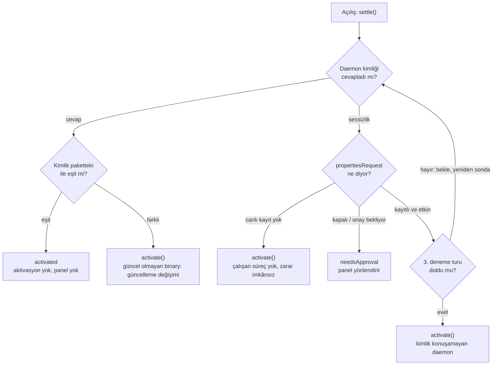

# ADR-0006 — Ölçülen Aktivasyon (Measured Activation)

## Durum

Kabul Edildi — 2026-08-05

Bu ADR, ADR-0002'nin (***Extension Gate Mekanizması***) aşağıdaki bölümlerinin yerini alır:

- **Madde 1'in kapanış paragrafı:** durum değişikliklerinin yalnızca kullanıcı kaynaklı olduğu ilkesi. Artık iki kapı vardır: açılış ölçümü ve kullanıcı eylemleri.
- **Madde 4'teki "OS seviyesinde idempotent" nitelemesi:** zaten etkin bir **Sistem Uzantısı (System Extension)** için aktivasyon talebinin sessizce `.completed` döndüğü varsayımı. Saha ölçümü aksini kanıtladı: aktivasyon, bayt-özdeş bundle için bile tam bir değişim sahneler. Bu aktif olan durumun sonlanması anlamına gelir. 
- **Madde 6'nın kaynak listesi:** durum kararlarının yalnızca `propertiesRequest` cevaplarından türediği ifadesi. Karar kaynağına uzantının kendi kimlik beyanı eklendi; kalıcı durum tutulmaması ilkesi aynen sürer.

Ayrıca ADR-0005'in (***Tünel Sırları için System Keychain Kasası***) 7. maddesindeki oturum sondası RPC yüzeyini genişletir: `pingVault` çağrısının adı ve yükü `pingIdentity` olmuştur (kimlik + kapı + sayı). Oturum kilidinin semantiği değişmemiştir.

## Bağlam

Kullanıcının gözünden yaşanan şuydu: tünel etkin, pencere sol üstten kapatıldı, uygulama arkada yaşıyor ve internet tünelden akmaya devam ediyor. Dock simgesine tıklanıp pencere geri açıldığında **Extension Gate** paneli bir anlığına parladı ve tünel listesi kapalı göründü. Tünel gerçekten ölmüştü. Aynısı uygulamayı tamamen kapatıp yeniden açınca da yaşandı: pencereyi açmak tüneli öldürüyordu.

Sistemin gözünden mekanizma tek satırlık bir log kanıtına iniyor:

```
actionForReplacingExtension: 2.0.0 → 2.0.0
```

`OSSystemExtensionRequest` üzerinden gönderilen her aktivasyon talebi, kurulu bundle sürümü gönderilenle bayt-özdeş olsa bile tam bir değişim sahneler. Değişim, uzantının çalışan provider süreçlerini öldürür. Kök görünüm ise her pencere doğuşunda üç uzantıya birden aktivasyon gönderiyordu. Sonuç: aktivasyon bir kurulum aracı olarak değil, farkında olmadan bir oturum giyotini olarak çalışıyordu.

Sorunun özü bir soru boşluğuydu. `propertiesRequest` "sistemde ne kurulu" sorusuna cevap verir; "kurulu olan, benim gemide taşıdığım binary mi" sorusuna vermez. Bu ikinci soruya cevap alınamadığı sürece tek güvenli görünen hamle her açılışta aktive etmekti ve bunun bedeli her açılışta ölen oturumlardı.

Cevabın zemini önceki kararların mirasında hazırdı. ADR-0004 ve ADR-0005 refaktörleri her uzantıya, süreç doğumunun ilk satırından itibaren yaşayan bir XPC daemon kazandırmıştı; mach servisleri launchd üzerinde kayıtlıdır ve bir çağrı uykudaki süreci uyandırır. Uzantılar zaten pinglenebilir durumdaydı. Eksik olan tek şey kimlik cevabıydı.

## Karar

1. **Kimlik damgası tek kaynak dosyadan gelir.** [`ExtensionIdentity.current`](https://github.com/ARAS-Workspace/phantom-wg/blob/mac-v2.0.1/Phantom-WG-MacOS/Domain/IPC/ExtensionIdentity.swift), `MARKETING_VERSION` değeridir ve dört hedefe de aynı kaynak dosyadan derlenir. Uygulamanın kendi değeri, gemide taşıdığı her uzantı için beklentidir; derleme anında sapma imkânsızdır. [`bump.sh`](https://github.com/ARAS-Workspace/phantom-wg/blob/mac-v2.0.1/.github/scripts/bump.sh) her sürümde bu değeri oynattığı için güncellemeler ek bir disiplin gerektirmeden yakalanır. `CURRENT_PROJECT_VERSION` bilinçli olarak damganın dışındadır.

2. **Her uzantı kimliğini kendi daemon yüzeyinden beyan eder.** **PhantomTunnel** tarafında oturum sondası genişledi: [`pingIdentity`](https://github.com/ARAS-Workspace/phantom-wg/blob/mac-v2.0.1/Phantom-WG-MacOS/Domain/IPC/TunnelVaultDaemonProtocol.swift) tek uçta kimlik, kasa kapısı ve payload sayısını döndürür; kasa daemon yüzeyinde ayrı bir kimlik ucu açılmaz, tek uç iki kilide hizmet eder ve kapı hatası cevabı dahi canlılık kanıtıdır. Proxy uzantıları paylaşılan protokole eklenen [`fetchIdentity`](https://github.com/ARAS-Workspace/phantom-wg/blob/mac-v2.0.1/Phantom-WG-MacOS/Domain/IPC/ProxyConfigDaemonProtocol.swift) ile cevap verir. Uzantı başına bir sinyal vardır; çapraz çıkarım yoktur, çünkü daemon süreçleri bağımsız yaşar ve ölür.

3. **Açılış aktive etmez; ölçer.** Her kontrolcünün açılış girişi [`settle()`](https://github.com/ARAS-Workspace/phantom-wg/blob/mac-v2.0.1/Phantom-WG-MacOS/Infrastructure/Initialization/ExtensionGateController.swift) ağacıdır: sonda cevap verirse kimlik karşılaştırılır, eşitlik aktivasyonu ve paneli tamamen atlatır, eşitsizlik meşru güncelleme değişimini başlatır. Sonda sessizse tek bir `propertiesRequest` hükmü belirler.

4. **Sessizlik tek başına asla anında aktive ettirmez.** `activate()` yalnız üç ölçülü kanıtla çağrılır: kimlik eşitsizliği, sistemde canlı kayıt olmaması ve deneme turlarının tükenmesi. Tükenme istisnası sınırlıdır: properties etkin derken üç tur boyunca sessiz kalan daemon, kimlik sözleşmesinden önceki bir nesil ya da kilitlenmiş bir süreçtir; ikisini de onaran şey zaten değişimdir.

5. **Ölçüm process başına bir kez koşar.** Pencere yeniden doğuşları salt okuma yoluna ([`checkAll()`](https://github.com/ARAS-Workspace/phantom-wg/blob/mac-v2.0.1/Phantom-WG-MacOS/Infrastructure/Initialization/ExtensionGateCoordinator.swift)) düşer. Ölçüm sürerken foreground yenilemesi o kontrolcüyü atlar; ağacın hükmü yazılana dek yazma tekeli ondadır. Meşru bir aktivasyon başladığında ise terfi kilidi devreye girer: uçuşta aktivasyon varken properties etkin dese bile `.activated` terfisi tutulur, terfi tamamlanma yoluna aittir. Böylece hazırlık sinyali ancak değişim süreci bittikten sonra açılır ve süreç sonrası mantık temiz zeminde koşar.

6. **Kalıcı hiçbir şey tutulmaz.** ADR-0002'nin ilkesi genişleyerek sürer: hiçbir karar önbelleğe alınmaz, her açılış kararı o an ölçülür. Ground truth artık iki kaynaktan okunur: işletim sisteminin kayıt defteri ve uzantının kendi kimlik beyanı.

7. **Geliştirme dengesi sürüm üzerinden kurulur.** Aynı sürümle yeniden derlenen yapı eski uzantıyı yerinde bırakır ve bunu logda açıkça söyler. Değişim istemek sürümü artırmaktır; sürüm yönetiminin tek sahibi `bump.sh` akışıdır.

## Karar Ağacı



## Sınır Durumları

| Sınır durumu | Davranış |
|---|---|
| Sağlıklı açılış: sonda cevapladı, kimlik eşit | `.activated` yazılır; aktivasyon da panel de yoktur. Saha ölçümünde üç uzantının ölçümü yaklaşık 50 ms sürdü |
| Güncelleme: sonda cevapladı, kimlik farklı | Anında `activate()`; tek geçişlik değişim. Her eşitsizlik bayat sayılır, eski biçimli damgalar dahil |
| Sonda sessiz, sistemde canlı kayıt yok | `activate()`; o uzantının çalışan süreci olamayacağı için kimse zarar görmez |
| Sonda sessiz, kayıtlı ama kapalı veya onay bekliyor | `.needsApproval`; aktivasyon bu durumu onaramaz, panel kullanıcıyı System Settings tarafına yönlendirir |
| Sonda sessiz, kayıtlı ve etkin | Geçici arıza varsayımı; 600 ms × deneme aralıklı üç deneme turu, aktivasyon yok |
| Üç tur sonunda hâlâ sessiz ve etkin | Kimlik konuşamayan daemon: sözleşme öncesi nesil veya kilitlenmiş süreç. `activate()` ikisini de onarır; geçiş kendini bir turda iyileştirir |
| Pencere yeniden doğuşu | Ölçüm process başına bir kezdir; sonraki girişler `checkAll()` salt okumasına düşer, değişim yaşanmaz |
| Ölçüm sürerken foreground yenilemesi | `isSettling` bayrağı o kontrolcüyü yenilemeden muaf tutar; geçici bir properties cevabı ağacın hükmünün üstüne yazamaz |
| Settle sorgusu ile normal yorum ayrımı | Settle tarafından açılan properties sorgusu nesne kimliğiyle ayrışır; normal durum yorumu yalnız `refresh()` çağrılarına hizmet eder |
| Aktivasyon uçuştayken properties etkin diyor | `.activated` terfisi tutulur; terfi `didFinishWithResult` sonrası yeniden sorguya aittir. Hazırlık sinyali fırtına bitmeden açılmaz |
| Terfi kilidinin kapsamı | Yalnız terfi tutulur; `.needsApproval` ve `.notInstalled` geçişleri canlı kalır, onay akışı sayaç yüzünden kilitlenemez |
| Tek uçlu tünel sondası | **PhantomTunnel** sondası kasa oturumuyla aynı `pingIdentity` ucuna biner; kasa daemon yüzeyinde ayrı bir kimlik ucu yoktur. Kapı hatası cevabı da canlılık kanıtıdır |
| Sonda enjekte edilmemiş kompozisyon | `settle()` ölçümsüz eski davranışa düşer: doğrudan `activate()`. Önizleme kompozisyonları bu yoldadır |
| Onay sonrası dönüş | `.needsApproval` durumundan System Settings toggle açılışıyla dönen uzantıyı foreground yenilemesi kimlik ölçmeden `.activated` yazar; bir sonraki açılış yeniden ölçer. Bilinçli sınırdır |
| Uygulama kaldırma | `uninstallAll()` sıralı deaktivasyonu değişmedi; sonraki açılışta sonda sessiz + kayıt yok yolundan temiz kurulum akışı koşar |
| Aynı sürümle geliştirme derlemesi | Eski uzantı yerinde kalır; log imzası `identity match ... activation skipped` nedenini her zaman söyler. Değişim istemek sürümü artırmaktır |

## Sonuçlar

- Pencereyi ya da uygulamayı yeniden açmak artık tüneli öldürmez. Saha kanıtı: değişimsiz her açılışta çalışan **PhantomTunnel** süreci hizmete aynen devam etti ve etkin tünel uygulamanın yeniden açılışından sağ çıktı.
- Sağlıklı açılışta **Extension Gate** paneli fiilen görünmez; ölçüm milisaniyeler içinde `.activated` yazar.
- Güncellemede tek geçişlik oturum kesintisi yaşanır. Bu bir sınır değildir; uzantının gerçekten değiştiği anın tanımıdır. Saha gözleminde işletim sistemi, değişimin ardından etkin tüneli kendiliğinden geri kurdu.
- Onay sonrası dönüş terfisi kimliksizdir ve bir sonraki açılış ölçümüne güvenir; bilinçli olarak kabul edilmiş en dar sınırdır.
- Kimlik sözleşmesinden önceki nesil uzantılar ilk açılışta üç deneme turunun bedelini öder, tükenme yoluyla değiştirilir ve akış kendini kalıcı olarak onarır.

## Literatürün Söyledikleri

- `activationRequest` belgeleri, talebin kurulu ve bayt-özdeş bir bundle üzerindeki davranışını tanımlamaz; `actionForReplacingExtension` yalnız "farklı sürüm bulunduğunda" çağrılacak biçimde anlatılır. Saha ölçümü, aynı sürüm çifti için de değişim delegesinin çağrıldığını ve çalışan provider süreçlerinin öldürüldüğünü gösterdi. Karar bu boşluğun üstüne kuruludur: davranış belgeden değil ölçümden okunur.
  https://developer.apple.com/documentation/systemextensions/ossystemextensionrequest
- `propertiesRequest` cevabının kurulu-ama-kapalı uzantıda boş dizi dönmesi empirik bir davranıştır ve ayırt etme yükü uygulamadadır; bu sözleşme ADR-0002'de belgelenmişti ve settle ağacının sessizlik dalı aynı sözleşmeye yaslanır.
  https://developer.apple.com/documentation/systemextensions/ossystemextensionrequest/propertiesrequest(forextensionwithidentifier:queue:)
- Mach servisi `NEMachServiceName` ile launchd üzerinde yayımlanır ve bir `NSXPCConnection` çağrısı uykudaki uzantı sürecini uyandırır; sondanın uyandırma gücü bu sözleşmeden gelir. Kayıt ve önkoşulları ADR-0003 ve ADR-0004'te belgelenmişti.
  https://developer.apple.com/documentation/foundation/nsxpcconnection
