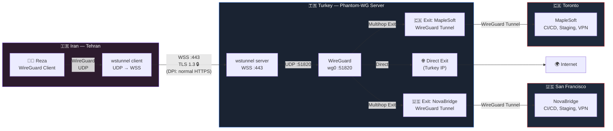
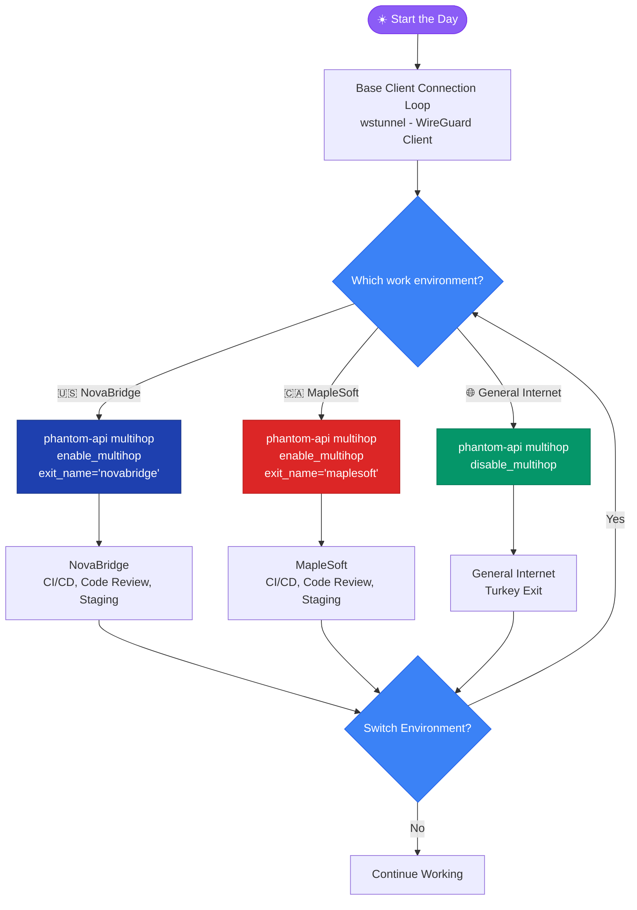

# Phantom-WG: Build a Censorship-Resistant WireGuard VPN on Your Own Server

## What is Phantom-WG?

**Your Server. Your Network. Your Privacy.**

[Phantom-WG](https://github.com/ARAS-Workspace/phantom-wg) is a modular tool for setting up and managing WireGuard VPN infrastructure on your own server.
Beyond basic VPN management, it provides censorship-resistant connections, multi-layer traffic routing, and advanced privacy scenarios.

| Module / Usage Scenario | Description                                                                                                                          |
|-------------------------|--------------------------------------------------------------------------------------------------------------------------------------|
| **Core**                | Client management, cryptographic key generation, automatic IP allocation, and service control                                        |
| **Ghost**               | Stealth mode that masks WireGuard traffic over WSS using [wstunnel](https://github.com/erebe/wstunnel), bypassing DPI systems        |
| **Multihop**            | Traffic routing and exit chaining through external WireGuard servers                                                                 |
| **MultiGhost**          | Combination of Ghost and Multihop; maximum privacy and censorship resistance                                                         |

> **Note:** Phantom-WG is a configuration orchestration tool; it automates the configuration steps you would otherwise perform manually on your server. It does not include any web interface or externally exposed attack surface.

---

## Reza's Story

***Reza*** is a software developer living in Tehran. He works remotely for two different companies:

- **NovaBridge** — A **Fin-Tech** company based in San Francisco. Reza works here as a *Backend Developer*.
- **MapleSoft** — A **SaaS** company based in Toronto. Reza contributes here as a *DevOps Engineer*.

> *Reza, NovaBridge, and MapleSoft are fictional names used to strengthen the narrative.*

Both companies use WireGuard configurations for access to their development environments. A WireGuard tunnel is a fundamental requirement in Reza's daily workflow to connect to CI/CD pipelines, internal services, and staging environments.

However, Iran has an advanced internet filtering and censorship infrastructure. DPI systems operating at the national gateways detect and block known VPN protocols, including WireGuard, through **signature analysis**, **behavioral fingerprinting**, and **packet size correlation**.

This situation directly affects Reza's access to his work environments.

### Before Phantom-WG: Complex and Fragile Solutions

Reza tried various methods to connect to the NovaBridge and MapleSoft environments:

- V2Ray / VMess / VLESS
- SSH Tunneling
- Shadowsocks
- Proxy Chains

Each method brought either complex configuration, additional tool dependencies, or connection instability. Keeping the connectivity infrastructure running before connecting to NovaBridge or MapleSoft each day had become a job in itself.

---

## Meeting Phantom-WG

When Reza discovered Phantom-WG, his scenario changed fundamentally.

Reza receives his payments from the companies he works for through crypto and alternative payment channels, and keeps his assets on a local exchange. This gives him the ability to purchase international services.

He rented a VPS from a provider in Turkey with **crypto payment**:

- **Debian 13** installed
- **Public IPv4** address
- **Turkey location** — Low latency to Iran, direct connectivity to Europe and North America

> 🎰 **Looking for a provider?** If you can't decide which provider to go with, try [Spin & Deploy](https://www.phantom.tc/wheel/) — randomly select from privacy-focused, crypto-friendly VPS providers!

After installing Phantom-WG on this server, Reza's architecture took shape:

- **Ghost Mode** — Tunnels WireGuard traffic over WSS using wstunnel through port 443 (HTTPS). DPI systems cannot distinguish this traffic from a standard web connection.
- **Multihop Exit: NovaBridge** — Adds the San Francisco company's WireGuard configuration as an exit. One command to switch to the development environment.
- **Multihop Exit: MapleSoft** — Adds the Toronto company's WireGuard configuration as an exit. Switching between environments takes a single command.
- **Direct Exit** — When Multihop is disabled, traffic exits through Turkey to the internet. A standard Turkey-exit connection without WireGuard traffic being detected.

### Installation

```bash
curl -sSL https://install.phantom.tc | bash
```


For configuration and usage details:

| Resource      | Link                                                                                 |
|---------------|--------------------------------------------------------------------------------------|
| GitHub        | [github.com/ARAS-Workspace/phantom-wg](https://github.com/ARAS-Workspace/phantom-wg) |
| Documentation | [docs.phantom.tc](https://docs.phantom.tc)                                           |
| Website       | [www.phantom.tc](https://www.phantom.tc)                                             |

---

## Reza's Internet Traffic Flow

Full architecture:



Reza's traffic flows from Tehran to the Phantom-WG server in Turkey, and from there to the target environments. But how does he switch between these environments in his daily work?



---

## Who is it For?

- **Remote developers** who, like Reza, need reliable access to company/organization VPNs
- **Privacy-focused users** looking for a self-hosted solution without relying on third-party VPN providers
- **Users focused on core functionality** who want to manage VPN traffic through their own infrastructure, without multi-user panels
- **Activists, journalists, and advocates** who need communication security

---

## License

Phantom-WG is open source under the [AGPL-3.0](https://github.com/ARAS-Workspace/phantom-wg/blob/main/LICENSE) license.

*WireGuard is a registered trademark of Jason A. Donenfeld. This project is not affiliated, associated, or endorsed by WireGuard.*

---

## Support

Phantom-WG is an open-source project. If you'd like to support the project:

**Bitcoin (BTC):**
```
bc1qnjjrsfdatnc2qtjpkzwpgxpmnj3v4tdduykz57
```

**Monero (XMR):**
```
84KzoZga5r7avaAqrWD4JhXaM6t69v3qe2gyCGNNxAaaJgFizt1NzAQXtYoBk1xJPXEHNi6GKV1SeDZWUX7rxzaAQeYyZwQ
```
