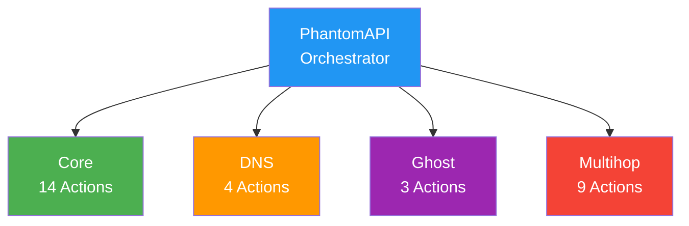
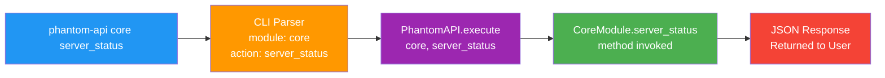

---
extra_javascript:
  - assets/javascripts/phantom-ascii.js
  - assets/javascripts/animated-ascii-art.js
---

# API

<div class="ascii-demo-container">
  <pre id="phantom-ascii-pulse" class="ascii-art" data-effect="pulse"></pre>
</div>

## Overview

Phantom-WG is a modular tool that allows you to set up and manage a WireGuard-based
VPN infrastructure on your own server. Beyond basic VPN management, it offers advanced
features such as DNS management synchronized with client configurations, censorship-resistant
connections by masking WireGuard traffic through wstunnel, and traffic routing through
external WireGuard endpoints.

These advanced features are delivered through four main modules:

- **Core** — Core VPN management. Covers client add/remove, configuration export, service
  control, firewall management, and network settings.
- **DNS** — Centralized DNS management. Manages DNS server configuration for all clients;
  changes are instantly reflected across all client profiles.
- **Ghost** — Censorship resistance. Tunnels WireGuard traffic over HTTPS via wstunnel,
  making it indistinguishable from standard web traffic.
- **Multihop** — Multi-hop routing. Routes traffic through external VPN exits, concealing
  the source-destination relationship and preventing any single point from seeing the entire flow.

### Module Architecture

PhantomAPI serves as the central orchestrator across all modules. Each module independently
executes operations (actions) within its area of expertise; PhantomAPI routes incoming
requests to the appropriate module and returns responses in a standardized format.



This architecture enables:
- Independent development and testing of each module
- Easy addition of new modules to the system
- Consistent response format across all modules

### API Request Processing

When an API call is made, the request follows this flow:

1. **Command Input** — User runs `phantom-api <module> <action>` command in the terminal
2. **CLI Parsing** — CLI tool analyzes the command, separating module, action, and parameters
3. **API Routing** — Request is forwarded to the PhantomAPI orchestrator
4. **Module Invocation** — The relevant method of the appropriate module is called and the operation is performed
5. **Response Generation** — Result is structured in standard JSON format and returned



The system can be accessed through two different methods:

- **CLI** — Rich TUI-based interactive interface launched with the `phantom-wg` command.
  Provides step-by-step guided menus for each module, color-coded status indicators, and
  paginated lists. Designed for users who want to manage the server without requiring
  technical knowledge. CLI preview recordings in this documentation show the interactive
  flow of the respective operations.

- **API** — Programmatic interface accessed via the `phantom-api` command. Each call returns
  a standard JSON response, enabling easy scripting, automation, cron jobs, and external
  integrations.

Both methods use the same underlying module infrastructure; any operation available in the
CLI can also be performed via the API.

---

## Basic Syntax

```bash
phantom-api <module> <action> [key=value ...]
```

---

## Response Format

All API responses follow a consistent JSON structure. This allows responses from different
modules and actions to be parsed using the same logic:

```json
{
  "success": true,
  "data": {
    "...": "Action-specific response data"
  },
  "metadata": {
    "module": "module_name",
    "action": "action_name",
    "timestamp": "2025-01-29T12:00:00Z",
    "version": "core-v1"
  }
}
```

Error responses:

```json
{
  "success": false,
  "error": "Error message",
  "code": "ERROR_CODE",
  "metadata": {
    "module": "module_name",
    "action": "action_name",
    "timestamp": "2025-01-29T12:00:00Z",
    "version": "core-v1"
  }
}
```

---
