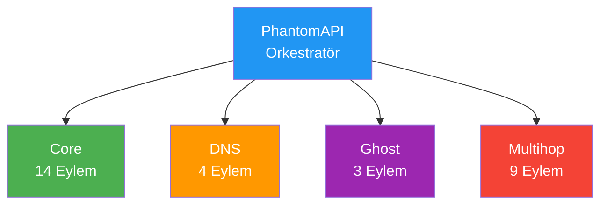
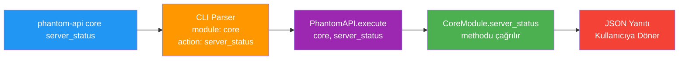

---
extra_javascript:
  - assets/javascripts/phantom-ascii.js
  - assets/javascripts/animated-ascii-art.js

---

# API

<div class="ascii-demo-container">
  <pre id="phantom-ascii-pulse" class="ascii-art" data-effect="pulse"></pre>
</div>

## Genel Bakış

Phantom-WG, kendi sunucu ortamınızda WireGuard tabanlı VPN altyapısı kurmanıza ve
yönetmenize olanak sağlayan modüler bir araçtır. Temel VPN yönetiminin ötesinde; istemci
yapılandırmalarıyla senkronize DNS yönetimi, wstunnel ile WireGuard trafiğini maskeleyerek
sansüre dayanıklı bağlantı kurma ve trafiği harici WireGuard uç noktaları üzerinden
yönlendirme gibi gelişmiş özelliklere sahiptir.

Bu gelişmiş özellikleri dört ana modül aracılığıyla sunar:

- **Core** — Temel VPN yönetimi. İstemci ekleme/kaldırma, yapılandırma dışa aktarma, servis
  kontrolü, güvenlik duvarı denetimi ve ağ ayarlarını kapsar.
- **DNS** — Merkezi DNS yönetimi. Tüm istemciler için DNS sunucu yapılandırmasını yönetir;
  değişiklikler anında tüm istemci profillerine yansır.
- **Ghost** — Sansür direnci. WireGuard trafiğini wstunnel ile HTTPS üzerinden tünelleyerek
  standart web trafiğinden ayırt edilemez hale getirir.
- **Multihop** — Çok atlamalı yönlendirme. Trafiği harici VPN çıkışları üzerinden
  ileterek kaynak-hedef ilişkisini gizler; tek bir noktanın tüm akışı görmesini engeller.

### Modül Mimarisi

PhantomAPI, tüm modüller arasında merkezi orkestratör görevi görür. Her modül kendi uzmanlık
alanındaki işlemleri (eylemler) bağımsız olarak yürütür; PhantomAPI ise gelen istekleri doğru
modüle yönlendirir ve yanıtları standart formatta döndürür.



Bu yapı sayesinde:

- Her modül bağımsız geliştirilebilir ve test edilebilir
- Yeni modüller sisteme kolayca eklenebilir
- Tüm modüller aynı yanıt formatını kullanır

### API İsteklerinin İşlenmesi

Bir API çağrısı yapıldığında istek şu akışı izler:

1. **Komut Girişi** — Kullanıcı terminalde `phantom-api <modül> <eylem>` komutunu çalıştırır
2. **CLI Ayrıştırma** — CLI aracı komutu analiz ederek modül, eylem ve parametreleri ayırır
3. **API Yönlendirme** — İstek PhantomAPI orkestratörüne iletilir
4. **Modül Çağrısı** — İlgili modülün ilgili metodu çağrılır ve işlem gerçekleştirilir
5. **Yanıt Oluşturma** — Sonuç standart JSON formatında yapılandırılır ve döndürülür



Sisteme iki farklı erişim yöntemiyle ulaşılabilir:

- **CLI** — `phantom-wg` komutuyla başlatılan Rich TUI tabanlı interaktif arayüz.
  Her modül için adım adım yönlendirmeli menüler, renk kodlu durum göstergeleri ve
  sayfalanmış listeler sunar. Teknik bilgiye ihtiyaç duymadan sunucuyu yönetmek isteyen
  kullanıcılar için tasarlanmıştır. Bu dokümantasyondaki CLI önizleme kayıtları ilgili
  işlemlerin interaktif akışını gösterir.

- **API** — `phantom-api` komutuyla erişilen programatik arayüz. Her çağrı standart bir
  JSON yanıtı döndürür; bu sayede betik yazımı, otomasyon, cron görevleri ve harici
  entegrasyonlar kolayca gerçekleştirilebilir.

Her iki yöntem de arka planda aynı modül altyapısını kullanır; CLI'da yapılabilen her işlem
API üzerinden de gerçekleştirilebilir.

---

## Temel Sözdizimi

```bash
phantom-api <modül> <eylem> [anahtar=değer ...]
```

---

## Yanıt Formatı

Tüm API yanıtları tutarlı bir JSON yapısını takip eder. Bu sayede farklı modüllerden
ve eylemlerden gelen yanıtlar aynı mantıkla ayrıştırılabilir:

```json
{
  "success": true,
  "data": {
    "...": "Eyleme özgü yanıt verisi"
  },
  "metadata": {
    "module": "modül_adı",
    "action": "eylem_adı",
    "timestamp": "2025-01-29T12:00:00Z",
    "version": "core-v1"
  }
}
```

Hata yanıtları:

```json
{
  "success": false,
  "error": "Hata mesajı",
  "code": "HATA_KODU",
  "metadata": {
    "module": "modül_adı",
    "action": "eylem_adı",
    "timestamp": "2025-01-29T12:00:00Z",
    "version": "core-v1"
  }
}
```
